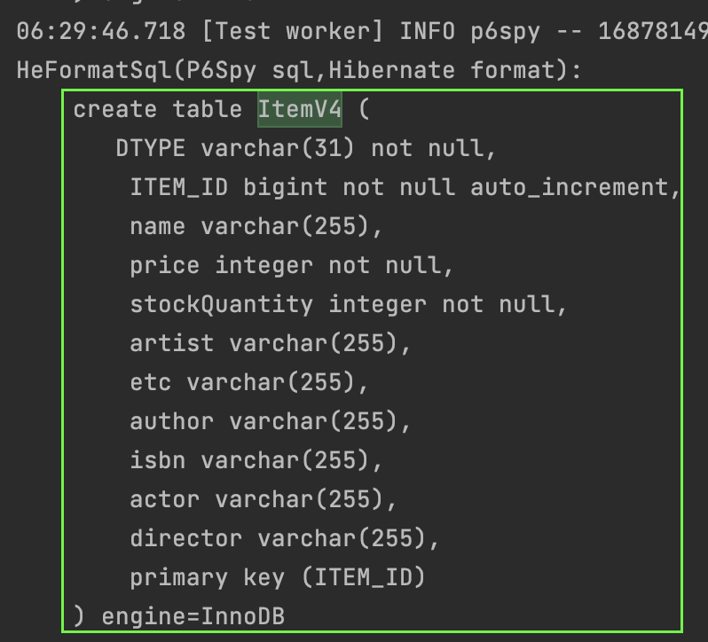
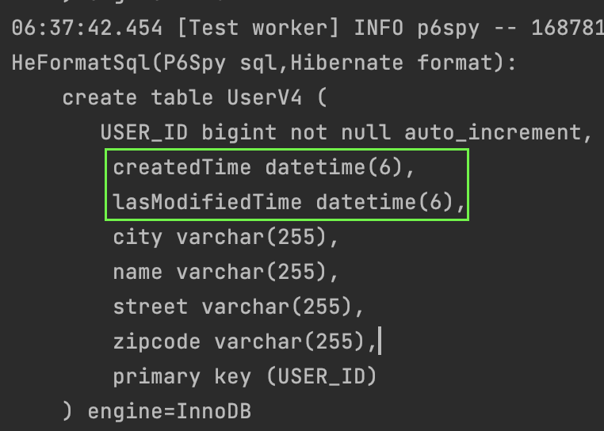

#### App v4
이번엔 아래와 같은 요구사항이 추가되었다.

~~~
- 상품의 종류는 음반, 도서, 영화가 있고 더 추가될 수 있다.
- 모든 데이터는 등록일과 수정일이 있어야 한다.
~~~

#### 상품종류 추가
[상속](../../../ch5/description/1_inheritance.md)에서 배운 `단일테이블전략`을 사용해서 구현해보자.  
먼저 `Item` 엔티티를 추상화하자.    
그리고, 기존의 엔티티에서 `@DiscriminatorColumn, @Inheritance` 두 어노테이션만 추가하면 된다.

~~~java
@Entity
@DiscriminatorColumn(name = "DTYPE")
@Inheritance(strategy = InheritanceType.SINGLE_TABLE)
public abstract class ItemV4 {
    @Id
    @GeneratedValue(strategy = GenerationType.IDENTITY)
    @Column(name = "ITEM_ID")
    private Long id;
    private String name;
    private int price;
    private int stockQuantity;

    @ManyToMany(mappedBy = "items")
    private List<CategoryV4> categories;
}
~~~

그리고 이를 상속하는 `앨범, 책, 영화` 엔티티를 만들자.    
각각의 엔티티에서 멤버변수로 가지고 있는 것들은 실제 데이터베이스에는 `Item` 테이블에 `null 허용` 컬럼으로 추가될 것이다.  

~~~java
@Entity
@DiscriminatorValue("A")
public class AlbumV4 extends ItemV4 {
    private String artist;
    private String etc;
}

@Entity
@DiscriminatorValue("B")
public class BookV4 extends ItemV4 {
    private String author;
    private String isbn;
}

@Entity
@DiscriminatorValue("M")
public class MovieV4 extends ItemV4 {
    private String director;
    private String actor;
}
~~~

`Item` 테이블생성 스크립트를 확인하자.

#### 모든 데이터에 등록일과 수정일  
지금까지 생성한 모든 엔티티에 `등록일과 수정일`을 추가해야 한다.  
생성된 모든 테이블에 두 컬럼을 추가하는것도 일이지만, 코드를 수정하는것도 여간 번거로운것이 아니다.  

[mapped-super-class.md](../../../ch5/description/2_mapped-super-class.md)에서 배운것을 사용할 때이다.

`등록일과 수정일`이 필요하다면 언제든 사용할 수 있도록 공통엔티티를 추가해보자.  

~~~java
@MappedSuperclass
public class BaseEntityV4 {
    private LocalDateTime createdTime;
    private LocalDateTime lasModifiedTime;
}
~~~

이제 이를 모든 엔티티에서 상속하도록 변경하자.  
예시는 `User` 엔티티만 하겠다.

~~~java
@Entity
public class UserV4 extends BaseEntityV4 {
    ...
}
~~~

