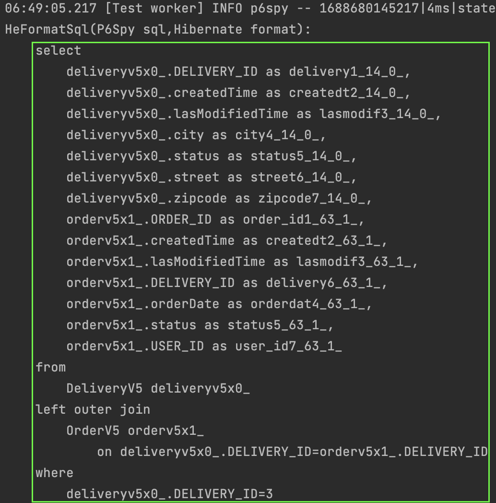

#### App v5
[`즉시로딩, 지연로딩`](../../../ch6/description/1_proxy.md)을 어플리케이션에 적용해보자.  
책에서는 일단 모두 `지연로딩`으로 설정하는것이 좋다고 가이드하고 있다.  
전부 `지연로딩`으로 하고 운영하면서 필요시에 `즉시로딩`으로 변경하면 되기 때문이다.   
따라서 어플리케이션에도 그렇게 설정해보려고 한다.

`@OneToMany, @ManyToMany`는 지연로딩이 기본이니 그대로 두면 된다.  
`@ManyToOne, @OneToOne`은 즉시로딩이 기본이니 여기서 지연로딩을 하도록 변경해보자.  

#### 즉시로딩 > 지연로딩 변경
~~~java
@Entity
public class OrderV5 extends BaseEntityV5 {
    @JoinColumn(name = "USER_ID")
    @ManyToOne(fetch = FetchType.LAZY)
    private UserV5 user;

    @OneToOne(fetch = FetchType.LAZY)
    @JoinColumn(name = "DELIVERY_ID")
    DeliveryV5 delivery;
    
    ...
}

@Entity
@NoArgsConstructor
public class OrderItemV5 extends BaseEntityV5 {
    @JoinColumn(name = "ITEM_ID")
    @ManyToOne(fetch = FetchType.LAZY)
    private ItemV5 item;

    @JoinColumn(name = "ORDER_ID")
    @ManyToOne(fetch = FetchType.LAZY)
    private OrderV5 order;

    ...
}
~~~

예시는 `배송`과 `주문`으로 해보자.  
아래의 코드에서 `select` 쿼리는 어떻게 생성될까?  
`배송`과 `주문`은 `@OneToOne` 관계이기때문에 `즉시로딩`이 기본이다.  
따라서 코드에서 주문관련 로직이 없더라도 일단 먼저 조인하여 `select`를 할 것이다.

~~~java
@Test
void lazyLoad() {
    final OrderV5 order = new OrderV5();
    order.setOrderDate(LocalDateTime.now());

    final DeliveryV5 delivery = new DeliveryV5();
    delivery.setZipcode("12345");

    template(manager -> {
        delivery.setOrder(order);
        order.setDelivery(delivery);

        // persist with cascade
        manager.persist(order);
    });

    template(manager -> {
        DeliveryV5 findDelivery = manager.getReference(DeliveryV5.class, delivery.getId());
        log.info("zipcode: {}", findDelivery.getZipcode());
    });
}
~~~

`select` 결과를 확인해보자.  

이제 지연로딩을 설정해보자.  

~~~java
@Entity
public class DeliveryV5 extends BaseEntityV5 {
    @OneToOne(mappedBy = "delivery", fetch = FetchType.LAZY)
    OrderV5 order;

    ...
}
~~~

다시 위의 테스트코드를 실행해보자.  
기대하는 결과값은 `주문`에 대해 사용하는 로직이 없으니 조인하지 않고 `배송테이블`만 조회하는 `select` 쿼리생성이다.

성공하였다.

#### 영속성 전이
[`영속성 전이`](../../../ch6/description/1_proxy.md)를 이용하여 엔티티를 관리해보자.  
`영속성 전이`를 이용하면 `연관관계의 주인`이 아닌 엔티티에서의 변경만으로도 `관련엔티티`를 변경시킬 수 있다.  
이미 `연관관계의 주인`이더라도 `주인엔티티`의 변경만으로 `관련엔티티`를 변경하는것은 불가능하다.  
`영속성 전이`를 이용하여 엔티티를 편리하게 관리해보자.  

예시로는 `주문엔티티`와 `배송엔티티`로 하자.  
`영속성 전이` 설정없이 `주문`과 `배송`을 저장하려면 아래와 같이 해야한다.  
만약 `manager.persist(delivery);` 코드를 제거한다면 영속화하지 않은 엔티티를 저장하려고하는 오류가 발생한다.    
`object references an unsaved transient instance - save the transient instance before flushing`

~~~java
@Test
void cascade() {
    template(manager -> {
        OrderV5 order = new OrderV5();
        DeliveryV5 delivery = new DeliveryV5();

        delivery.setOrder(order);
        order.setDelivery(delivery);

        // persist without cascade
        manager.persist(delivery);
        manager.persist(order);
    });
}
~~~

이제 영속성전이를 설정해보자.  

~~~java
@Entity
public class OrderV5 extends BaseEntityV5 {
    @OneToOne(fetch = FetchType.LAZY, cascade = CascadeType.ALL)
    @JoinColumn(name = "DELIVERY_ID")
    DeliveryV5 delivery;
    
    ...
}
~~~

이제 `manager.persist(delivery);`코드를 제거하더라도 알아서 `주문`과 `배송`을 저장해준다.  
`영속성 전이`의 편리함이다.

~~~java
@Test
void cascade() {
    template(manager -> {
        OrderV5 order = new OrderV5();
        DeliveryV5 delivery = new DeliveryV5();

        delivery.setOrder(order);
        order.setDelivery(delivery);

        // persist with cascade
//            manager.persist(delivery);
        manager.persist(order);
    });
}
~~~

