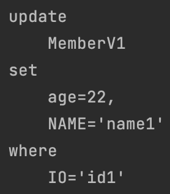
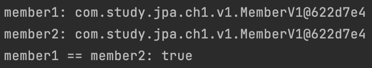
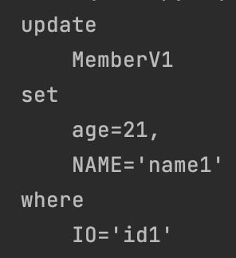
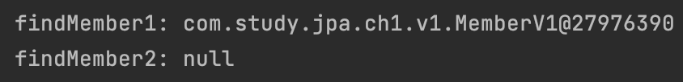

#### Persistence Context
JPA에서 중요한 개념인 `Persistence Context`에 대해서 알아보자.

[예시](v1-1_hello-jpa.md)에서는 두 곳에서 `setAge()`를 수행한다.  
그런데 첫 번째 `setAge(20)`에서는 데이터베이스에서 쿼리가 수행되지 않고,    
두 번째 `setAge(21)`에서는 실제 update 쿼리가 수행된다.  

이 차이는 `Persistence Context`에 등록되었는지 여부에 따라 다르게 된다.  
`Persistence Context`는 무엇일까?  
간단하게 `Entity 저장소`라고 생각하자.  
그리고 이는 `EntityManager`를 통해 접근 및 수정이 가능하며 `EntityManager` 1개 당 1개의 `Persistence Context`가 생성된다고 생각하자.  
요약하자면 `EntityManager 별 Entity 저장소`가 되겠다.  
실제로는 여러 `EntityManager`가 같은 `Persistence Context`에 접근할수 있지만 지금은 시작 단계이니 멀티쓰레드 환경은 뒤에서 다루자.  

#### 특성
##### 구조
`Persistence Context`의 구조는 쉽게 `map` 으로 생각하자.    
우리가 `@Entity`에서 지정한 `@Id` 값이 `key`가 되고 객체가 `value`가 된다.  
따라서, `Persistence Context`에서 `@Id` 없이 저장이 안된다.  
또한, 조회할 때에도 `@Id` 단위로 조회해올 수 있다.  
위의 예시에서 `id1`을 통해 조회한 것이 그 이유이다.

##### lifecycle
`Entity`는 네 가지 상태가 존재한다.  
`비영속(new/transient), 영속(managed), 분리(detached), 삭제(removed)` 이다.  

`transient/new`   
쉽게 말하자면 `persist()`가 호출되기 이전상태이다.  
그리고 `Persistence Context`에 등록되기 이전 상태이기도 하다.  
[예시](v1-1_hello-jpa.md)에서 `persist()` 이전에 아무리 많은 `setAge()` 함수가 호출된다 하더라도, 데이터베이스와는 아무런 상관이 없는 평범한 자바 객체일 뿐이다.

`managed`   
`Persistence Context`에 등록된 상태이다.  
[예시](v1-1_hello-jpa.md)에서 `persist()` 호출을 통해 등록된다.  
이때부터는 `setAge()`가 호출되면 실제 `update`가 진행될 수 있다.  
혹은 `find()` 가 호출되면 `Persistence Context`에 해당 `Entity`가 있을 시에 먼저 찾게 된다. 

`detached`  
`Persistence Context`에 등록되었다가 해지된 상태이다.  
사실 이때부터도 마치 `transient` 상태처럼 `Entity`와 데이터베이스는 무관하게 된다.  
`detach()`를 통해 특정 `Entity`만 `Persistence Context`에서 제거할 수도 있고,    
혹은 `close()`를 통해 아예 `Persistence Context`를 닫을 수도 있다.    
아니면 `clear()`를 통해 `Persistence Context`를 초기화 할수도 있다.

`removed`  
이름은 `Persistence Context`와 관련이 없어보이지만, `delete` 액션과 밀접하다.    
`Persistence Context`에서 `remove()`하게되면 커밋할 시에 `Persistence Context`에서 제거하면서 실제 데이터베이스에서도 해당 데이터를 삭제한다.

#### 사용 시 이점
##### 쓰기지연 저장소
JPA는 `flush` 전까지는 아무리 많은 `insert, update`가 수행되더라도 실제 데이터베이스로 쿼리를 수행하지 않는다.  
`flush` 직전까지 `쓰기지연 저장소`에 `sql`을 모아두었다가 한번에 처리한다.  

테스트코드를 통해 확인해보자.  

~~~java
private void writeBehind(EntityManager manager) {
    MemberV1 member = new MemberV1();
    member.setId("id1");
    member.setUsername("name1");
    member.setAge(20);

    // insert
    manager.persist(member);

    // update
    member.setAge(21);

    // update
    member.setAge(22);
}
~~~

위의 코드에서 `persist()`를 통해 `Persistence Context`에 데이터를 등록하고 `setAge()`가 두 번 호출됨으로서 `update sql`은 몇 번 수행될까?  
로그를 보면 아래의 쿼리가 한번 수행된다.

이렇게 `쓰기지연 저장소`를 이용하면 데이터베이스에 수행하는 쿼리를 최소화할수 있는 성능상 이점이 있다.

##### 1차 캐시
~~~java
private void findInCache(EntityManager manager) {
    MemberV1 member = new MemberV1();
    member.setId("id1");
    member.setUsername("name1");
    member.setAge(20);

    // insert
    manager.persist(member);

    // select
    MemberV1 findMember = manager.find(MemberV1.class, "id1");
    log.info("findMember: {}", findMember);
}

private void findInDatabase(EntityManager manager) {
    MemberV1 member = new MemberV1();
    member.setId("id1");
    member.setUsername("name1");
    member.setAge(20);

    // insert
    manager.persist(member);

    // select
    MemberV1 findMember = manager.find(MemberV1.class, "id2");
    log.info("findMember: {}", findMember);
}
~~~
두 코드에서 `find()` 함수가 수행되지만 실제 데이터베이스에서 `select`를 수행하는지 여부는 다르다.    
`findInCache`에서는 `Persistence Context`에 `id1` 키 기준으로 데이터가 있기 때문에 실제 데이터베이스에서 조회하지 않고 이 값을 조회한다.    
`findInDatabase`에서는 `Persistence Context`에 `id2` 키 기준으로 데이터가 없기 때문에 실제 데이터베이스에서 `select`를 수행한다.  
`Persistence Context`가 데이터베이스 조회 전에 1차 캐시 역할을 해주어 성능상 이점을 가져갈 수 있는 것이다.

##### 동일성 보장
~~~java
private void equals(EntityManager manager) {
    MemberV1 member = new MemberV1();
    member.setId("id1");
    member.setUsername("name1");
    member.setAge(20);

    // insert
    manager.persist(member);

    // select
    MemberV1 member1 = manager.find(MemberV1.class, "id1");
    MemberV1 member2 = manager.find(MemberV1.class, "id1");

    log.info("member1: {}", member1.toString());
    log.info("member2: {}", member2.toString());
    log.info("member1 == member2: {}", member1 == member2);
}
~~~
위의 코드에서 로그는 아래와 같이 찍힌다.

`Persistence Context`는 일종의 메모리저장소이다.  
따라서 여기서 가져오는 `member1, member2`는 같은 메모리주소를 가지게 되며 동일성도 보장한다.  
설사 데이터베이스에서 가져온다고해도 동일성은 당연히 보장된다.  
첫번째 `find()`에서는 데이터베이스에서 가져와서 `Persistence Context`에 등록할 것이고,  
두번째 `find()`에서는 첫번째 `find()`에서 `Persistence Context`에 등록된 데이터를 그대로 가져올 것이기 때문이다.  
동일성은 `Persistence Context`가 1차캐시의 역할을 해주면서 부가적으로 가질 수 있는 이점이다.  

##### 변경감지
JPA는 `find()`, `remove()`는 있지만 `update()`는 별도로 없다.    
`Persistence Context`에 등록된 `Entity`의 `setter`함수를 호출해주면 `flush` 시점에 `update sql`이 생성된다.    
`Persistence Context`에 최초로 등록될 시점에 `Entity`의 스냅샷과 `flush` 시점에 `Entity`의 데이터를 비교하여 작동하기 때문이다.  

데이터베이스에 아래의 데이터가 존재한다고 가정해보자.  

~~~java
MemberV1 member = new MemberV1();
member.setId("id1");
member.setUsername("name1");
member.setAge(20);

// insert
manager.persist(member);
~~~

이제 아래의 두 코드를 각각 실행한다고 가정했을 떄에 어떤 차이가 있는 지 알아보자.  

~~~java
private void updateMemberViolationFail(EntityManager manager) {
    MemberV1 member = new MemberV1();
    member.setId("id1");
    member.setUsername("name2");
    member.setAge(21);

    // insert 가 수행되어 violation fail
    manager.persist(member);
}

private void updateMemberSuccess(EntityManager manager) {
    MemberV1 member = manager.find(MemberV1.class, "id1");
    member.setId("id1");
    // member.setUsername("name2");
    member.setAge(21);

    // update
    manager.persist(member);
}
~~~
`updateMemberViolationFail`는 `violation fail` 오류가 발생한다.   
`Persistence Context`에 아무런 데이터가 없는채로 `persist()`가 수행되었기 때문이다.  
변경감지는 최초로 `Persistence Context`에 등록될 때에 생성한 `Entity` 스냅샷과 `flush` 시점에 `Entity`를 비교하여 `update sql`을 생성한다고 하였는데,  
`Persistence Context`에 등록된 데이터가 없으니 `update sql`이 아닌 `insert sql`이 생성된 것이다.  

`updateMemberSuccess`은 정상적으로 `update sql`이 생성된다.  
`find()`를 통해 `Persistence Context`에 등록된 `Entity` 스냅샷과 `flush` 시점의 `Entity`의 `age` 변수 데이터가 다르기 때문이다.  
그래서 생성되는 `update sql` 로그는 아래와 같다.

 

##### @DynamicUpdate @DynamicInert
이상한 게 있다. `name='name1'` 부분이다.  
변경된 부분은 `age` 뿐인데 `update` 문에서는 왜 `name` 까지 포함할까?  
이렇게 하는 이유는 `update sql`문을 어플리케이션이 로딩되는 시점에 `update sql` 을 미리 생성해둘 수 있기 때문이다.  
그래서 이 쿼리 하나로 어플리케이션이 종료될 때까지 재사용할 수 있기 때문이다.  

그러한 이유로 변경감지되지 않은 데이터도 `update sql`에 포함이 되지만, 이는 찝찝한 부분이 있다.  
컬럼이 50개인데 하나의 값만 변경되어도 전체 컬럼 `update`가 수행될 것이기 때문이다.  
컬럼수가 특정개수를 넘어가면 이는 쿼리재사용의 성능이점이 아닌 오히려 성능악화가 될 수 있다.  
따라서 `Entity`에 `@DynamicUpdate @DynamicInert` 등의 어노테이션을 붙여서 변경되는 데이터만 `update sql`에 포함되도록 할 수 있다.  

예시에서 `@DynamicUpdate`를 붙여서 테스트해보길 바란다.

##### remove 주의사항
`remove()`는 실행시에 `Persistence Context`에서 곧바로 제거된다.  
그렇다고 데이터베이스에서 바로 삭제되는 것은 아니다. 위에서 배운 `쓰기지연 저장소`에 쿼리만 저장되고 실행시점은 `flush`로 동일하다.  
다만, `Persistence Context`에서는 바로 제거되는 것 뿐이다.  
이렇게 하는 이유는 개발자 입장에서는 `Persistence Context`를 마치 데이터베이스처럼 사용해야하야 하는데,  
`remove()`는 개발자 입장에서 `delete`를 수행했다고 생각하게 된다.   
따라서 `remove` 이후에는 `find`를 하더라도 결과값에 나오지 않아야 하기 때문에 `Persistence Context`에서 바로 제거한다.  

아래의 테스트코드를 보고 빠르게 넘어가자.

~~~java
private void removeFromPersistenceContext(EntityManager manager) {
    MemberV1 member = new MemberV1();
    member.setId("id1");
    member.setUsername("name1");
    member.setAge(20);

    // insert
    manager.persist(member);

    // select
    MemberV1 findMember1 = manager.find(MemberV1.class, "id1");
    log.info("findMember1: {}", findMember1);

    // delete
    manager.remove(findMember1);

    // select
    MemberV1 findMember2 = manager.find(MemberV1.class, "id1");
    log.info("findMember2: {}", findMember2);
}
~~~

로그는 아래와 같이 출력된다.

