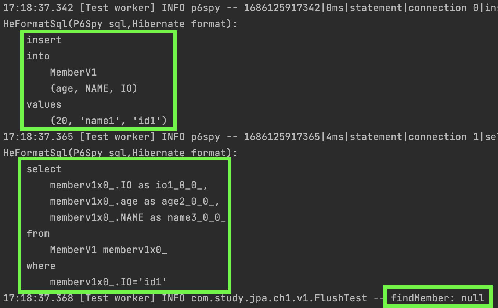
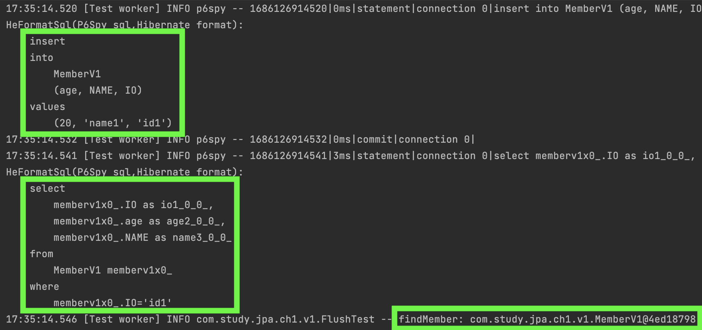
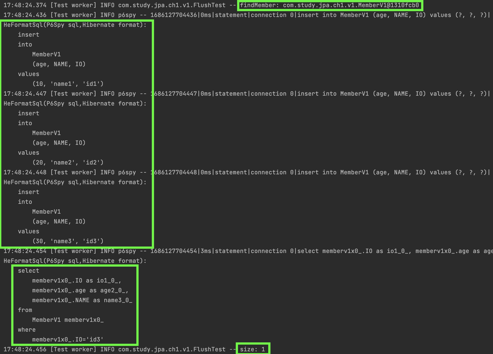
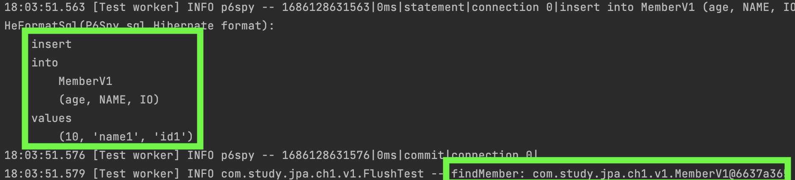

#### flush
`flush()`를 실행하면 `Persistence Context`에 있는 데이터의 변경내용을 데이터베이스에 반영한다.  
구체적으로는 아래와 같은 일이 수행된다.  

~~~
1. Persistence Context에 있는 스냅샷과 Entity를 비교하여 수정된 Entity를 찾는다. 수정된 Entity는 쓰기지연 저장소에 SQL을 등록한다.
2. 쓰기지연 저장소에 있는 SQL을 데이터베이스로 전송한다.
~~~

#### `flush()`는 언제 수행될까?  

~~~
1. EntityManager의 flush()를 직접 수행한다.
2. 트렌젝션 commit()을 수행한다.
3. JPQL 쿼리수행 시 flush()가 자동으로 호출된다.
~~~

##### flush() without commit()
위에서 `flush()`를 하면 쓰기지연 저장소에 있는 SQL을 데이터베이스로 전송한다고 했지, 데이터베이스에 반영된다고 하지는 않았다.  
결국 `commit()`을 하지 않으면 데이터베이스에 최종적으로 저장되지 않는다.  

~~~java
@Test
void flushWithoutCommit() {
    templateOnlyFlushWithoutCommit(
            (manager) -> {
                MemberV1 member = new MemberV1();
                member.setId("id1");
                member.setUsername("name1");
                member.setAge(20);

                // insert
                manager.persist(member);
            }
    );

    templateOnlyFlushWithoutCommit(
            (manager) -> {
                MemberV1 findMember = manager.find(MemberV1.class, "id1");
                log.info("findMember: {}", findMember);
            }
    );
}
~~~

여기서 로그는 아래와 같이 찍힌다.

`flush()` 시점에 SQL을 데이터베이스로 전송은 하지만, 결국 `commit()`을 하지 않았기 때문에  
다음 `find()`에서 해당 데이터를 찾지 못한다.

##### commit() without flush()
그럼 반대로 `flush()`는 하지 않고 `commit()`만 수행하게 되면,  
`flush()`의 역할인 SQL을 `쓰기지연 저장소`에 보내주는 작업이 선행되지 않기 때문에 아무것도 수행되지 않을까?  

그렇지 않다.  
JPA에서는 `commit()`시에 `flush()`를 자동으로 수행해준다.

##### JPQL
JPQL과 같은 객체지향 쿼리를 수행할 때에도 `flush()`가 수행된다.    
아래의 로그는 어떻게 찍히는지 생각해보자.
~~~
@Test
void jpql() {
    templateOnlyCommitWithoutFlush(
            (manager) -> {
                MemberV1 member1 = new MemberV1();
                member1.setId("id1");
                member1.setUsername("name1");
                member1.setAge(10);

                // insert
                manager.persist(member1);

                MemberV1 member2 = new MemberV1();
                member2.setId("id2");
                member2.setUsername("name2");
                member2.setAge(20);

                // insert
                manager.persist(member2);

                MemberV1 member3 = new MemberV1();
                member3.setId("id3");
                member3.setUsername("name3");
                member3.setAge(30);

                // insert
                manager.persist(member3);

                // find
                MemberV1 findMember = manager.find(MemberV1.class, "id1");
                log.info("findMember: {}", findMember);

                // JPQL
                List<MemberV1> memberV1List = manager.createQuery("SELECT m FROM MemberV1 m WHERE m.id = 'id3'", MemberV1.class).getResultList();
                log.info("size: {}", memberV1List.size());
            }
    );
}
~~~

로그를 보면 JPQL수행 전에 `쿼리가 수행되는 것(flush)`을 볼 수 있다.  
아직 `commit()`을 하기 전이라 실제 데이터베이스에 반영되지는 않았겠지만, `size: 1`가 찍히는 것은 트렌젝션 안에서 `dirty-read`를 하기 때문일 것이다.    
`findMember: null`의 의미는 JPQL 수행전의 `find()`는 `flush()`를 수행하지 않고 `Persistence Context`에서 읽어오는 것을 보여주는 것이다.  

#### 주의사항
`flush()`의 주의사항은 `flush()`가 수행된다고 해서  
`Persistence Context`에 있는 `Entity`가 사라지는 것이 아니라는 것이다.

~~~java
@Test
void findAfterFlush() {
    EntityManager manager = factory.createEntityManager();
    EntityTransaction transaction = manager.getTransaction();

    try {
        transaction.begin();

        MemberV1 member1 = new MemberV1();
        member1.setId("id1");
        member1.setUsername("name1");
        member1.setAge(10);

        // insert
        manager.persist(member1);

        transaction.commit();

        MemberV1 findMember = manager.find(MemberV1.class, "id1");
        log.info("findMember: {}", findMember);
    } catch (Exception e) {
        log.error("{}", e);
        transaction.rollback();
        throw e;
    } finally {
        manager.close();
    }
}
~~~
위의 예시에서 `commit()`이후에 `find()`를 하면 정상적으로 조회가 된다.    
로그는 아래와 같다.

