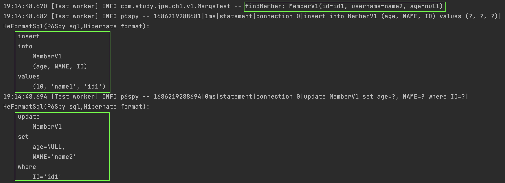

#### merge()
`merge()`에 대해서 알아보자.  
`merge()`는 `Entity`를 `Persistence Context`에 등록한다.  
그렇다면 `persist()`와 어떤 차이가 있을까?  

#### merge(), persist()
~~~java
@Test
void persist() {
    // insert member
    template(manager -> {
        MemberV1 memberV1 = new MemberV1();
        memberV1.setId("id1");
        memberV1.setUsername("name1");
        memberV1.setAge(10);

        manager.persist(memberV1);

        return memberV1;
    });

    assertThrows(
            RollbackException.class,
            () -> template(manager -> {
                MemberV1 memberV1 = new MemberV1();
                memberV1.setId("id1");
                memberV1.setUsername("name2");
                memberV1.setAge(20);

                // persist
                manager.persist(memberV1);

                return memberV1;
            }));
}

@Test
void merge() {
    // insert member
    template(manager -> {
        MemberV1 memberV1 = new MemberV1();
        memberV1.setId("id1");
        memberV1.setUsername("name1");
        memberV1.setAge(10);

        manager.persist(memberV1);

        return memberV1;
    });

    template(manager -> {
        MemberV1 memberV1 = new MemberV1();
        memberV1.setId("id1");
        memberV1.setUsername("name2");
        memberV1.setAge(20);

        // merge
        manager.merge(memberV1);

        return memberV1;
    });
}
~~~
`persist()`에서는    
같은 `@Id`로 `Persistence Context`에 `Entity`가 이미 있으면 `Entity`가 이미 있기 떄문에 오류가 발생한다.
`Persistence Context`에 `Entity`가 없다면 새로 등록하려는 `Entity`를 스냅샷으로 같이 등록할 것이다.  
위의 예시에서는 `Persistence Context`에 `id1`으로 `Entity`가 없었기 때문에 `Persistence Context`에는 정상적으로 등록까지 성공하였다.     
이후 `commit()` 시점에 새로 등록하려는 `Entity`를 그대로 `insert` 시도하였고 오류가 발생하였다.  

`merge()`에서는   
같은 `@Id`로 `Persistence Context`에 `Entity`가 이미 있으면 기존의 `Entity`를 스냅샷으로 보고 `merge`하려는 `Entity`는 `Persistence Context`에 등록된다.  
그리고 스냅샷과 `Entity`의 데이터차이를 `update sql`로 생성하여 `쓰기지연 저장소`에 보낸다.  
`Persistence Context`에 `Entity`가 없다면 데이터베이스를 조회한다.  
데이터베이스에 값이 있다면 데이터베이스의 값을 스냅샷으로 보고, 새로 등록하려는 `Entity`를 `Persistence Entity`에 등록한다.  
그리고 스냅샷과 새로 등록하려는 `Entity`의 데이터 차이를 `update sql`로 생성하여 `쓰기지연 저장소`에 보낼 것이다.
위의 예시에서는 데이터베이스에서 조회한 데이터를 스냅샷으로 보고 새로 `merge`하려는 `Entity`와의 데이터차이를 `update sql`로 생성하여 `쓰기지연 저장소`에 보낸다.

##### persist() and persist()
같은 `@Id`로 `persist()`를 두 번하면 이미 `Persistence Context`에 같은 `key`값으로 `Entity`가 있다는 `EntityExistsException` 오류가 발생한다.

~~~java
@Test
void persistAndPersist() {
    template(manager -> {
        // persist
        MemberV1 member1 = new MemberV1();
        member1.setId("id1");
        member1.setUsername("name1");
        member1.setAge(10);
        manager.persist(member1);

        // persist
        MemberV1 member2 = new MemberV1();
        member2.setId("id1");
        member2.setUsername("name2");
        assertThrows(EntityExistsException.class, () -> manager.persist(member2));

        return member2;
    });
}
~~~

##### persist() and merge()
같은 `@Id`로 `persist()` 후에 `merge()`를 하면 어떻게 될까?  
기존 `persist()`로는 `insert`가 수행된다.  
그리고 `merge()`에서는 기존의 같은 `@Id`로 등록된 `Entity`를 스냅샷으로 보고, `merge()`하려는 `Entity`와의 데이터 차이를 `update sql`을 생성하여 `쓰기지연 저장소`에 보낸다.  
로그를 통해 확인해보자.

