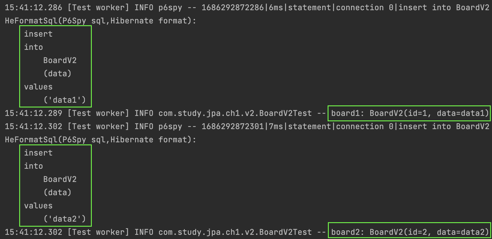
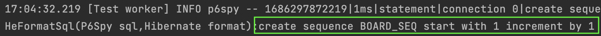
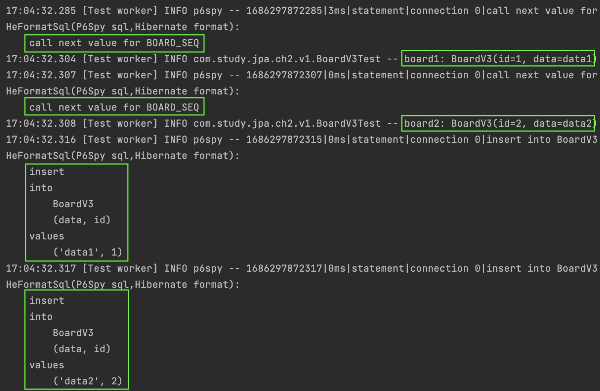
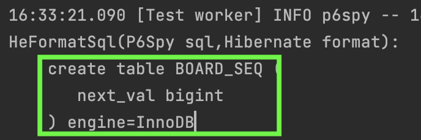
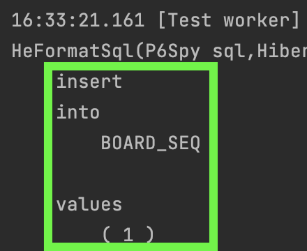
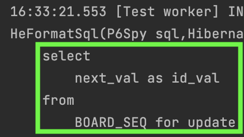
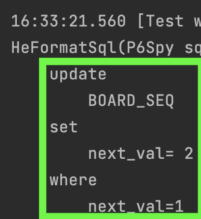
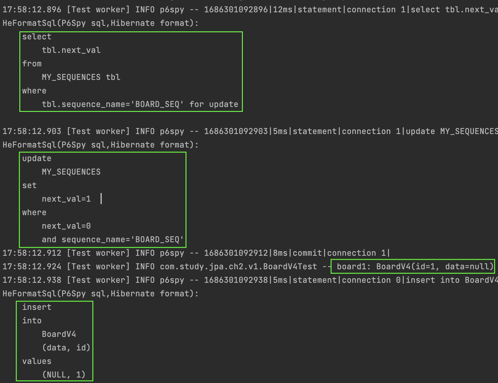

#### 기본 키 매핑
테이블에서 기본키를 매핑하는 방법은 데이터베이스마다 다를 것이다.  
`auto_increment`와 같은 설정을 사용하는 경우에도 데이터베이스마다 작동방식이 다르다.  
예를 들어, `mysql`은 별도의 시퀀스를 제공하지 않지만, 오라클은 별도의 시퀀스를 생성하여 시퀀스를 통해 테이블 별 키를 관리한다.  
JPA에서는 이러한 설정들을 어떻게 다루는 지 알아보자.  

#### IDENTITY
기본키 생성을 데이터베이스에 위임하는 전략이다.  
예를 들어 `mysql`에서 `auto_increment` 기능을 사용하는 경우에 해당한다.  

~~~java
@Entity
public class BoardV2 {
    @Id
    @GeneratedValue(strategy = GenerationType.IDENTITY)
    private int id;
    private String data;
}
~~~

이제 `insert` 테스트코드를 돌려보자.

~~~java
@Test
void insert() {
    template((manager) -> {
        BoardV2 board1 = new BoardV2();
        board1.setData("data1");
        manager.persist(board1);
        log.info("board1: {}", board1);

        BoardV2 board2 = new BoardV2();
        board2.setData("data2");
        manager.persist(board2);
        log.info("board2: {}", board2);
    });
}
~~~

결과로그는 아래와 같다. 

`Board` 객체에 `id`가 바인딩 된 것을 볼 수 있다.  
`IDENTITY` 전략은 실제 데이터베이스에 `insert` 쿼리를 전달해야만 `id` 값을 바인딩 할 수 있기 때문에,  
`persist()`가 호출되자마자 바로 데이터베이스에 쿼리가 전달된다. (`commit` 하는것은 아니다.)    
따라서 `Persistence Context`의 장점인 `쓰기지연`을 사용할 수 없다는 단점이 있다.

#### SEQUENCE
오라클과 같은 데이터베이스에서는 별도의 시퀀스를 이용하여 특정 테이블의 키값을 관리할 수 있다.  
우리는 시퀀스를 제공하는 데이터베이스 `h2`와 제공하지 않는 데이터베이스 `mysql` 두 환경에서의 동작을 모두 알아보자.  
`Entity` 세팅은 아래와 같이 동일하다.  

~~~java
@Entity
@SequenceGenerator(
        name = "BOARD_SEQ_GENERATOR",
        sequenceName = "BOARD_SEQ",
        initialValue = 1, 
        allocationSize = 1
)
public class BoardV3 {
    @Id
    @GeneratedValue(
            strategy = GenerationType.SEQUENCE,
            generator = "BOARD_SEQ_GENERATOR"
    )
    private int id;
    private String data;
}
~~~

두 테스트 모두 아래의 테스트코드를 수행한다.

~~~java
@Test
void insert() {
    template((manager) -> {
        BoardV3 board1 = new BoardV3();
        board1.setData("data1");
        manager.persist(board1);
        log.info("board1: {}", board1);

        BoardV3 board2 = new BoardV3();
        board2.setData("data2");
        manager.persist(board2);
        log.info("board2: {}", board2);
    });
}
~~~

##### `h2`에서 `SEQUENCE` 사용
실제 `insert` 쿼리를 수행해보고 로그를 확인해보자.

먼저 실제 시퀀스를 생성한다.

`board1, board2` 로그를 찍는 순서를 주의깊게 보자.  
로그를 풀이해보자면 아래와 같다.  

`BOARD_SEQ` 시퀀스에서 시퀀스번호를 획득한다.  
`Persistence Context`에 `board1 Entity`를 등록한다.    
`BOARD_SEQ` 시퀀스에서 시퀀스번호를 획득한다.    
`Persistence Context`에 `board2 Entity`를 등록한다.

`SEQUENCE` 타입 키관리는 `IDENTITY` 방식과 달리 `Entity`에 해당하는 테이블에 쿼리를 수행하지 않고도  
`Persistence Context`에 `Entity`를 등록할 수 있다.  
다만 `IDENTITY` 방식과 달리 데이터베이스와 두 번 통신해야하는 단점이 있다.  
시퀀스 조회시에 한번, 데이터 `insert`시에 한번 해야하기 때문이다.  

이렇게 두 번통신하는것이 부담스럽다면 `@SequenceGenerator.allocationSize`를 통해 조절해볼 수 있다.    
`allocationSize`는 시퀀스에서 한번에 가져올 키 값의 사이즈이다.    
`50`으로 설정한다면 한번에 `50`개를 가져오고 메모리에 `50`개의 키값을 저장해두어, 메모리에 저장된 키를 소진할때까지는 데이터베이스에 시퀀스를 다시 조회하지 않을 것이다.  
이것이 `allocationSize` 디폴트값이 `50`으로 설정된 이유이다.    
이 방법의 장점은 데이터베이스 접근횟수를 줄이는 것이고, 단점은 시퀀스값이 매우빠르게 증가하는 것이다.

##### `mysql`에서 `SEQUENCE` 사용
실제 `insert` 쿼리를 수행해보고 로그를 확인해보자.  

먼저 주의깊게 볼 부분은 `SEQUENCE` 타입으로 헀지만 `mysql`은 시퀀스를 지원하지 않기 때문에 테이블이 생성된것을 볼 수 있다.  
`next_val` 이라는 변수를 가진 일반 테이블이다.  

그리고 초기값으로 `1`을 넣는 작업을 한다.  
이는 최초에 한 번만 수행되는 작업이다. 초기 값이 있어야 이 테이블을 참조하면서 계속 값을 증가시킬 수 있기 때문이다.  

`h2`에서는 `call next value for BOAD_SEQ` 수행을 통해 시퀀스의 값을 획득했다.  
하지만 `mysql`에서는 테이블이기 때문에 `select for update` 함수를 통해 해당 세션이 끝날때까지 `BOAD_SEQ`에 `lock`을 잡게 된다.  
트레픽이 많은 환경에서 매우 부담스러운 작업이 아닐 수 없다.  
이 이유가 시퀀스를 지원하지 않는 데이터베이스에서 `SEQUENCE` 타입을 설정하면 안되는 주된 이유가 될 것 같다.

 
`Persistence Context`에 `Entity`를 정상적으로 등록헀다면, 시퀀스 테이블을 1증가시켜주는 것까지하고 마무리한다.   

#### TABLE
`TABLE` 전략은 키 생성전용 테이블을 만들어두고 시퀀스를 흉내내는 전략이다.  
우리는 위에서 `mysql`에 `SEQUENCE` 설정을 해보았는데 매우 유사하게 작동할 것으로 생각된다.  
그래도 한번 코드는 작성해보자.  

`TABLE` 전략은 키 생성전용 테이블을 미리 생성해두어야 한다.  
아래와 같이 생성해보자.  
이는 임의로 생성한것이 아니며 `TABLE` 설정으로 키관리를 하기위해 정해진 포멧이다.

~~~sql
CREATE TABLE MY_SEQUENCES (
      sequence_name VARCHAR(255) NOT NULL,
      next_val INTEGER,
      PRIMARY KEY (sequence_name)
)
~~~

이제 `Entity` 객체를 만들자.  

~~~java
@Entity
@TableGenerator(
        name = "BOARD_SEQ_GENERATOR",
        table = "MY_SEQUENCES",
        pkColumnValue = "BOARD_SEQ",
        allocationSize = 1
)
public class BoardV4 {
    @Id
    @GeneratedValue(
            strategy = GenerationType.TABLE,
            generator = "BOARD_SEQ_GENERATOR"
    )
    private int id;
    private String data;
}
~~~

데이터를 하나 넣어보고 로그를 살펴보자.  

`sequence_name` 컬럼에 `BOARD_SEQ` 이름으로 데이터를 넣는 것을 볼 수 있다.  
초기 데이터는 `0`으로 시작한다. (`initValue` 값으로 설정가능하다.)

데이터를 넣기위해 먼저 `MY_SEQUENCES` 테이블의 `BOARD_SEQ`에서 키값을 가져온다.  
그리고 가져옴과 동시에 키값을 1 증가시킨다.  
그리고 `board1` 로그가 찍혔으니 `Persistence Context`에 등록이 되었음을 알 수 있다.  
`insert` 전에 `Persistence Context`에서 관리가 되니 `쓰기지연`이 작동한다고 볼 수 있다.  
마지막으로 `flush` 시점에 `insert`가 수행된다.  

이 방법은 `SEQUENCE` 보다도 데이터베이스에 쿼리를 한번 더 수행한다.  
`select, update`를 수행해야 하기 때문이다.  
실제 데이터를 넣는 `insert`까지 포함하면 3번이라고 볼 수 있다.   

#### AUTO
`AUTO`는 JPA의 디폴트 키매핑 전략이다.  
`@GeneratedValue`에 아무런 설정을 하지 않는다면 `AUTO`로 설정된다.  
이 설정은 데이터베이스 `Dialect`에 따라 JPA가 자동으로 키매핑전략을 선택한다.

시퀀스를 제공하는 데이터베이스라면 `SEQUENCE`가 될 것이고,  
별도의 시퀀스를 제공하지 않는 데이터베이스라면 `IDENTITY`가 될 것이다.

