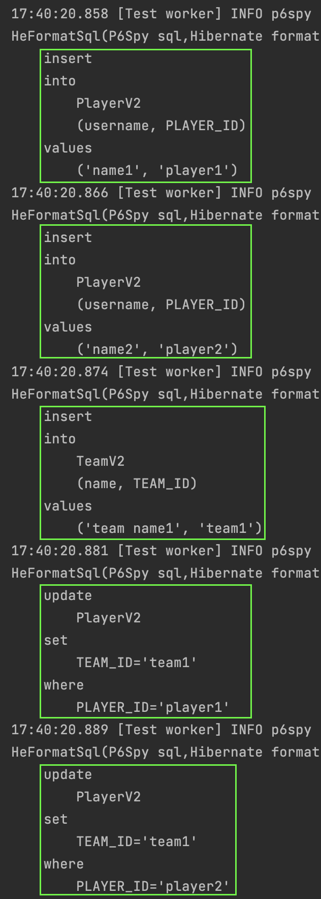

#### OneToMany
`OneToMany`는 [many-to-one](1_many-to-one.md)에서 보았듯이,  
하나의 `Team`에 여러개의 `Player`가 매핑되는 관계를 의미한다.  

다른 점은 외래키를 `Team`에서 관리하는 것이다.  
실제 테이블에서도 `Player`에 외래키가 있는데 굳이 그런 경우를 한번 해보는 공부라고 생각하자.

코드는 아래와 같다.

#### 일대다 단방향
~~~java
@Entity
public class PlayerV2 {
    @Id
    @Column(name = "PLAYER_ID")
    private String id;
    private String username;

//    @ManyToOne
//    @JoinColumn(name = "TEAM_ID", insertable = false, updatable = false)
//    private TeamV2 team;
}

@Entity
public class TeamV2 {
    @Id
    @Column(name = "TEAM_ID")
    private String id;

    private String name;

    @OneToMany
    @JoinColumn(name = "TEAM_ID")
    private List<PlayerV2> players = new ArrayList<>();
}
~~~

위와 같이 설정하고 데이터를 넣어보자.  

~~~java
@Test
void insert() {
    template(manager -> {
        PlayerV2 player1 = new PlayerV2();
        player1.setId("player1");
        player1.setUsername("name1");

        PlayerV2 player2 = new PlayerV2();
        player2.setId("player2");
        player2.setUsername("name2");

        TeamV2 team1 = new TeamV2();
        team1.setId("team1");
        team1.setName("team name1");
        team1.setPlayers(List.of(player1, player2));

        manager.persist(player1);
        manager.persist(player2);
        manager.persist(team1);
    });
}
~~~
위 코드에서 쿼리는 몇번 수행될까?  
무려 5번이다.  

실제 로그를 보며 절대 이렇게 쓰지 말자 다시 다짐하자.  

#### 일대다 양방향
위의 `PlayerV2`에서 주석을 제거하면 일대다 양방향 관계가 된다.  
`insertable = false, updatable = false` 등 설정할게 많다.  
