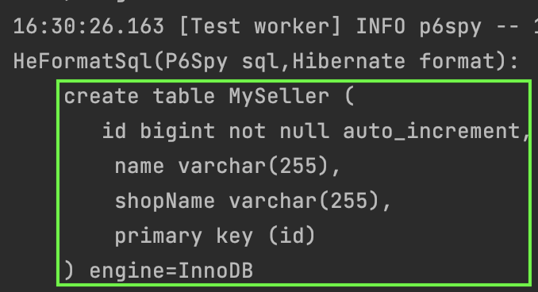
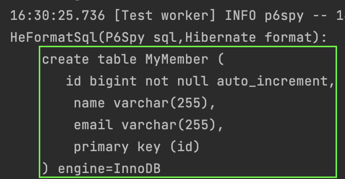

#### MappedSuperclass
테이블을 관리하다보면 공통적으로 들어가는 컬럼들이 있다.  
예를들어 `등록일시`와 같은 컬럼이다.  
혹은 회원타입이 여러가지가 있고, 모든 회원은 이름과 이메일을 가지고 있을 수 있다.  
대부분 테이블에 공통된 컬럼이 들어있다면, jpa에서는 이를 효율적으로 관리할 수 있는 대안을 제공한다.

`MappedSuperclass` 어노테이션이다.  
코드를 보면서 알아보자.

코드의 예시는 `기본엔티티`가 `키값과 이름`을 관리한다.  
그리고 이를 상속하는 `회원엔티티`는 `이메일`을 가지고 있고,  
`판매자엔티티`는 `상점명`을 가지고 있다.

~~~java
@MappedSuperclass
public abstract class BaseEntity {
    @Id
    @GeneratedValue(strategy = GenerationType.IDENTITY)
    private Long id;
    private String name;
}

@Entity
public class MyMember extends BaseEntity {
    private String email;
}

@Entity
public class MySeller extends BaseEntity {
    private String shopName;
}
~~~

실제 생성되는 스크립트는 아래와 같다.  

