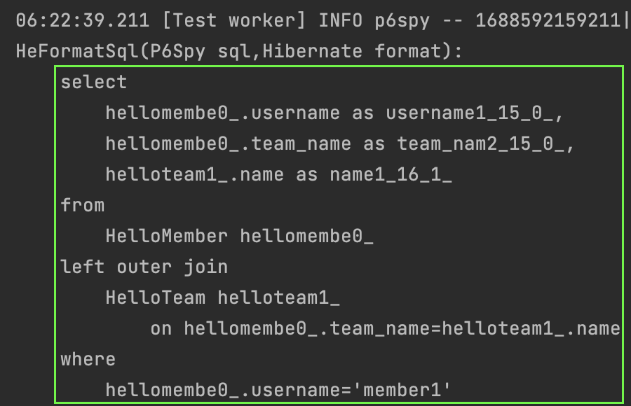
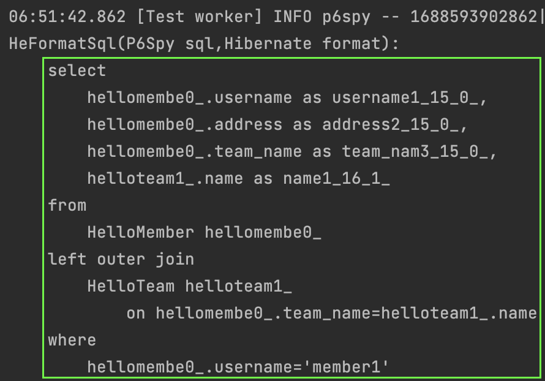
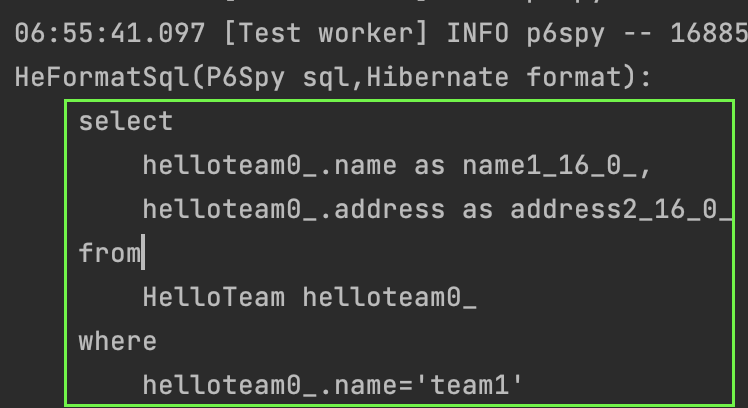
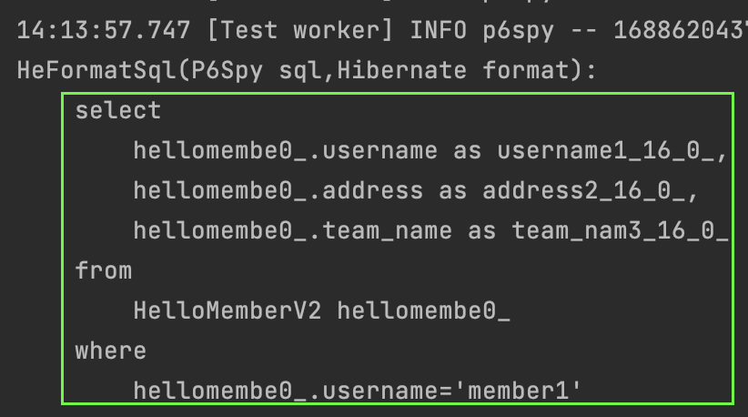
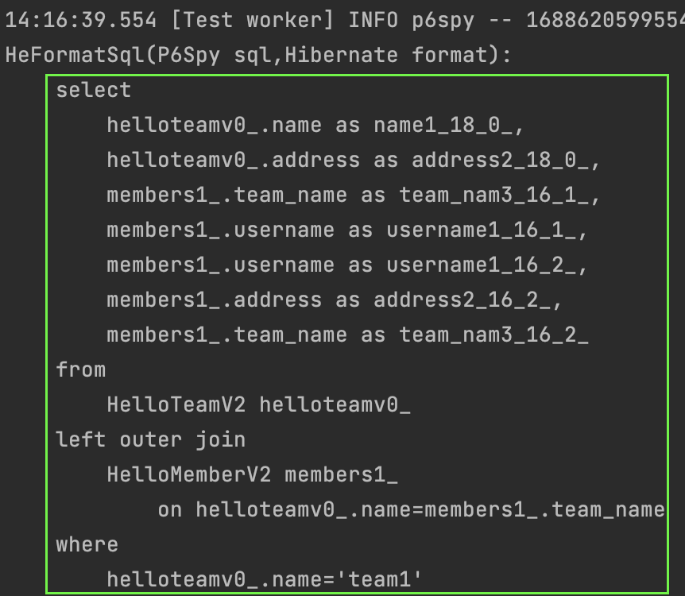

#### Proxy
[프록시 패턴](https://github.com/outgrow0905/study-patterns/blob/main/src/main/java/com/example/patterns/M_Proxy/Proxy.md)은 이미 공부한 적이 있다.  
`프록시패턴`은 여러 이유로 사용할 수 있다.  
`특정기능을 제한`하기 위해서 사용할 수도 있고, `지연로딩` 혹은 `캐싱`을 위해 사용할수도 있다.  
jpa에서는 `지연로딩`을 위해 `프록시패턴`을 사용한다.  
알아보자.

#### 지연로딩
먼저 엔티티 두개를 생성해보자.

~~~java
@Entity
public class HelloTeam {
    @Id
    private String name;

    @OneToMany(mappedBy = "team")
    private List<HelloMember> members;
}

@Entity
public class HelloMember {
    @Id
    private String username;

    @ManyToOne
    private HelloTeam team;
}
~~~

이제 간단하게 데이터를 넣고 jpa를 통해 조회해보는 테스트코드를 만들어보자.

~~~java
@Test
void uselessJoin() {
    template(manager -> {
        HelloTeam team = new HelloTeam();
        team.setName("team1");
        manager.persist(team);

        HelloMember member = new HelloMember();
        member.setUsername("member1");
        member.setTeam(team);
        manager.persist(member);
    });

    template(manager -> {
        HelloMember member = manager.find(HelloMember.class, "member1");
        log.info("name: {}", member.getUsername());
    });
}
~~~

`find()`에서 jpa는 어떤 쿼리를 만들까?  
`member` 테이블만 조회하는것이 아무래도 효율적일 것 같다.  
`team` 외래키의 주인이기는 하지만 아직 사용을 하는곳이 없으니 굳이 `team` 테이블은 아직 조회할 필요가 없기 때문이다.  

생성되는 쿼리는 아래와 같다.

기대와 달리 로직에서 한번도 사용되지 않는 `team` 테이블까지 조인이 되었다.  
`find()`는 그렇게 작동하는 메서드이다.  
프록시를 사용하는 메서드는 `getReference()`이다. 사용해보자.

#### getReference()
그럼 `getReference()`를 사용한 아래에서는 어떤 쿼리가 생성될까?  
이상하게도 아무런 `select` 쿼리가 수행되지 않는다.  
그 이유는 `member`의 `@id 즉 pk` 값을 조회하기 때문이다.  
이는 데이터베이스 조회 없이 영속성 컨텍스트에서 바로 리턴이 가능하기 때문에 지연로딩의 조건에 해당하지 않는다.

~~~java
@Test
void proxy1() {
    template(manager -> {
        HelloTeam team = new HelloTeam();
        team.setName("team1");
        manager.persist(team);

        HelloMember member = new HelloMember();
        member.setUsername("member1");
        member.setTeam(team);
        manager.persist(member);
    });

    template(manager -> {
        HelloMember member = manager.getReference(HelloMember.class, "member1");
        log.info("name: {}", member.getUsername());
    });
}
~~~

`member` 엔티티에 `address` 필드를 추가하고 이를 조회해보자.  

~~~java
@Test
void proxy2() {
    template(manager -> {
        HelloTeam team = new HelloTeam();
        team.setName("team1");
        manager.persist(team);

        HelloMember member = new HelloMember();
        member.setUsername("member1");
        member.setAddress("address1");
        member.setTeam(team);
        manager.persist(member);
    });

    template(manager -> {
        HelloMember member = manager.getReference(HelloMember.class, "member1");
        log.info("name: {}", member.getAddress());
    });
}
~~~

의도한대로 `select` 쿼리는 생성되었다.   
하지만, 의도한대로 `member` 테이블만 조회하지 않고 계속해서 `team` 테이블과 조인을 한다.  
똑같은 테스트를 `team` 기준으로 해보자.

~~~java
@Test
void proxy3() {
    template(manager -> {
        HelloTeam team = new HelloTeam();
        team.setName("team1");
        team.setAddress("address1");
        manager.persist(team);

        HelloMember member = new HelloMember();
        member.setUsername("member1");
        member.setAddress("address1");
        member.setTeam(team);
        manager.persist(member);
    });

    template(manager -> {
        HelloTeam team = manager.getReference(HelloTeam.class, "team1");
        log.info("name: {}", team.getAddress());
    });
}
~~~

`member, team` 같은 로직인데 `team`을 기준으로 테스트해보면 불필요하게 조인을 하지 않고 의도한대로 작동한다.  
이유는 jpa의 최적화 전략(?)에 있다.  
`@ManyToOne`의 경우는 `FK`를 기준으로 조인하기 때문에 성능상 크게 손실이 없으며 오히려 `select` 를 두번 수행하는 것보다 조인 한번이 나을 수 있다.  
그러나 `@OneToMany`의 경우는 예를 들어, `team`과 조인된 `member`가 많아질수록 조인을 미리하면 성능이 저하된다.  
무엇보다, 조인된 데이터가 얼마나 있을 지 예측할 수 없기 때문에 더더욱 조인을 하지 않는것이 안전하다.  

따라서, jpa에서는 `@ManyToOne, @OneToOne`의 경우는 `즉시로딩`을 기본정책으로 하고  
`@OneToMany, @ManyToMany`의 경우는 `지연로딩`을 기본정책으로 하고 있다.  
이것이 위의 `member, team` 에서 `select` 쿼리의 조인이 다르게 생성되는 이유이다. 

`즉시로딩, 지연로딩`을 알아보기전에 프록시여부를 확인할수있는 간단한 유틸을 알아보고 넘어가자.
아래 코드에서 `PersistenceUnitUtil`을 사용하면 프록시객체가 초기화되었는지 여부를 알 수 있다.  
아래 테스트코드에서는 차래로 `false, true`를 리턴하게 된다.

~~~java
@Test
void proxy3() {
    template(manager -> {
        HelloTeam team = new HelloTeam();
        team.setName("team1");
        team.setAddress("address1");
        manager.persist(team);

        HelloMember member = new HelloMember();
        member.setUsername("member1");
        member.setAddress("address1");
        member.setTeam(team);
        manager.persist(member);
    });

    template(manager -> {
        HelloTeam team = manager.getReference(HelloTeam.class, "team1");
        log.info("isProxy: {}", manager.getEntityManagerFactory().getPersistenceUnitUtil().isLoaded(team)); // false
        log.info("name: {}", team.getAddress());
        log.info("isProxy: {}", manager.getEntityManagerFactory().getPersistenceUnitUtil().isLoaded(team)); // true
    });
}
~~~

#### 즉시로딩, 지연로딩
위에서 말한것 처럼 jpa에서는 즉시로딩과 지연로딩의 기본정책이 있지만 별도로 세팅도 가능하다.  
공부하는 차원이니 jpa 기본정책과 반대로 `@OneToMany`에는 `즉시로딩`을, `@ManyToOne`에는 `지연로딩`을 설정해보자.

~~~java
@Entity
public class HelloTeamV2 {
    @Id
    private String name;

    private String address;

    @OneToMany(mappedBy = "team", fetch = FetchType.EAGER)
    private List<HelloMemberV2> members;
}

@Entity
public class HelloMemberV2 {
    @Id
    private String username;

    private String address;

    @ManyToOne(fetch = FetchType.LAZY)
    private HelloTeamV2 team;
}
~~~

테스트코드는 아래와 같다. 
기대하기로는 `@ManyToOne`이지만 `즉시로딩`을 하지않고 `지연로딩`하는 것이다. 

~~~java
@Test
void proxy4() {
    template(manager -> {
        HelloTeamV2 team = new HelloTeamV2();
        team.setName("team1");
        team.setAddress("address1");
        manager.persist(team);

        HelloMemberV2 member = new HelloMemberV2();
        member.setUsername("member1");
        member.setAddress("address1");
        member.setTeam(team);
        manager.persist(member);
    });

    template(manager -> {
        HelloMemberV2 member = manager.getReference(HelloMemberV2.class, "member1");
        log.info("name: {}", member.getAddress());
    });
}
~~~

결과는 아래와 같다.  
기대한대로 `지연로딩`을 하기 때문에 조인하지 않고 `member` 테이블만 조회하였다.

반대로 `team`에서의 조회는 `@OneToMany` 임에도 즉시로딩을 하는지 확인해보자.

~~~java
@Test
void proxy5() {
    template(manager -> {
        HelloTeamV2 team = new HelloTeamV2();
        team.setName("team1");
        team.setAddress("address1");
        manager.persist(team);

        HelloMemberV2 member = new HelloMemberV2();
        member.setUsername("member1");
        member.setAddress("address1");
        member.setTeam(team);
        manager.persist(member);
    });

    template(manager -> {
        HelloTeamV2 team = manager.getReference(HelloTeamV2.class, "team1");
        log.info("name: {}", team.getAddress());
    });
}
~~~

아래와 같이설정한대로 동작하는것을 볼 수 있다.  
아래의 캡쳐에서 한가지 짚고 넘어갈 것은 `left outer join` 부분이다.    
`left outer join`을 선택한 이유는 특정 팀에 소속된 멤버가 한명도 없을 경우에 `일반조인`을 할 경우 결과값에 나오지 않기 때문이다.

  

반대로 `member` 기준으로 `team`을 `즉시로딩`으로 조회했다고 가정해보자.  
이 경우에도 `left outer join`이 생성된다.  
어떤 팀에도 소속되지 않은 멤버의 경우 `일반조인`을 할 경우 결과값에 나오지 않기 때문이다.  
하지만, 특정 회원이 반드시 한 팀에 소속되어야 한다면 `left outer join`은 성능상 손실이다.  

이 부분은 해당 컬럼이 `null 허용`인지 아닌지 명시해주면 된다.  
이는 두 방법으로 가능한데 `@JoinColumn`의 `nullable` 설정을 이용하거나,  
`@ManyToOne`의 `optional` 설정을 `true`로 설정하면 된다.    
이해히기 어렵지 않은  부분이니 넘어가자.
