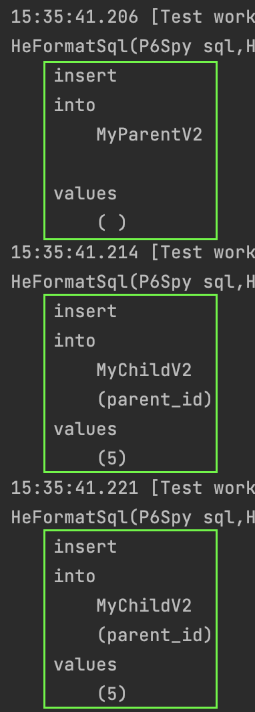

#### 영속성 전이: CASCADE
영속성 전이에 대해서 알아보자.  
먼저 부모-자식 관계의 엔티티를 만들어보자.

~~~java
@Entity
public class MyParentV1 {
    @Id
    @GeneratedValue(strategy = GenerationType.IDENTITY)
    private int id;

    @OneToMany(mappedBy = "parent")
    private List<MyChildV1> children;
}

@Entity
public class MyChildV1 {
    @Id
    @GeneratedValue(strategy = GenerationType.IDENTITY)
    private int id;

    @ManyToOne
    private MyParentV1 parent;
}
~~~

이제 자식 두개와 부모 하나의 엔티티를 저장해보자.  
먼저 `parent`를 영속상태로 만든 뒤에 `child`에 `parent`를 주입하여 저장한다.

~~~java
@Test
void withoutCascade() {
    template(manager -> {
        MyParentV1 parent = new MyParentV1();
        manager.persist(parent);

        MyChildV1 child1 = new MyChildV1();
        child1.setParent(parent);
        manager.persist(child1);

        MyChildV1 child2 = new MyChildV1();
        child2.setParent(parent);
        manager.persist(child2);
    });
}
~~~

이제 `parent`에 `CASCADE` 옵션을 적용해보자.  
`parent`만 수정하면 된다.

~~~java
@Entity
public class MyParentV2 {
    @Id
    @GeneratedValue(strategy = GenerationType.IDENTITY)
    private int id;

    @OneToMany(mappedBy = "parent", cascade = CascadeType.PERSIST)
    private List<MyChildV2> children;
}
~~~

이제 다시 데이터를 저장해보자.  
`CASCADE`를 설정한 `parent` 엔티티 `persist` 한번에 모든 데이터가 저장된다.  
사실 코드를 보면 크게 줄어든 것은 없다.  
단지 영속화하는 부분만 편하게 해주는 기능정도로 알고 넘어가자.

~~~java
@Test
void cascadePersist() {
    template(manager -> {
        MyChildV2 child1 = new MyChildV2();
        MyChildV2 child2 = new MyChildV2();

        MyParentV2 parent = new MyParentV2();
        child1.setParent(parent); // 저장 안하면 child 테이블에 insert 할떄에 parent fk가 null로 저장된다.
        child2.setParent(parent);
        parent.setChildren(List.of(child1, child2));

        manager.persist(parent);
    });
}
~~~

  

`CascadeType`을 보니 삭제도 있을 것이다.  
이것도 해보고 넘어가자.  
아래와 같이 `CascadeType`을 하나 더 추가하면 된다.

~~~java
@OneToMany(mappedBy = "parent", cascade = {CascadeType.PERSIST, CascadeType.REMOVE})
private List<MyChildV2> children;
~~~

먼저 `CascadeType.REMOVE` 설정을 하기 전에 엔티티삭제를 수행해보자.  
아래의 코드는 오류가 발생한다.  
`parent`와 매핑된 `child`가 있는데 `parent`를 제거할 수 없다는 `SQLIntegrityConstraintViolationException` 오류이다.  

`CascadeType.REMOVE`를 설정하고 수행하면 깔끔하게 성공한다.  
삭제하려는 `parent`와 매핑된 `child`를 먼저 제거하고 그 다음에 `parent`를 삭제해주기 때문이다. 

~~~java
@Test
void cascadeRemove() {
    template(manager -> {
        MyChildV2 child1 = new MyChildV2();
        MyChildV2 child2 = new MyChildV2();

        MyParentV2 parent = new MyParentV2();
        child1.setParent(parent);
        child2.setParent(parent);
        parent.setChildren(List.of(child1, child2));

        // persist
        manager.persist(parent);

        // remove
        manager.remove(parent);
    });
}
~~~