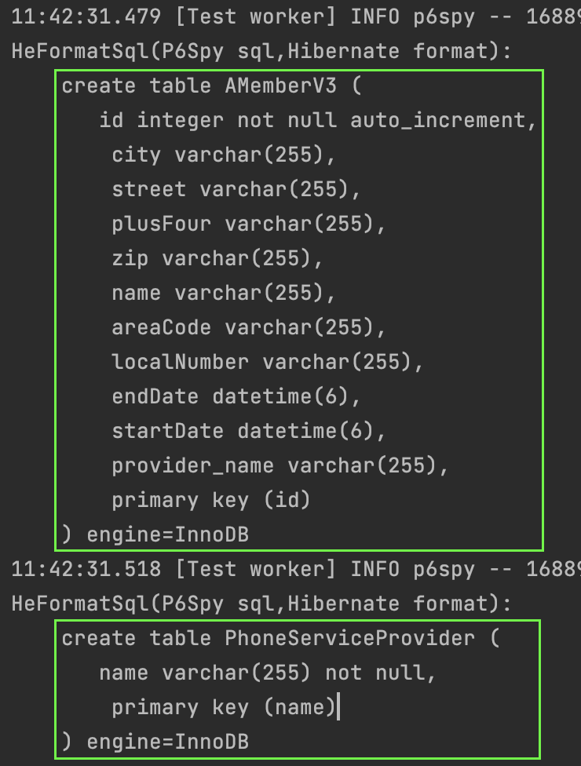
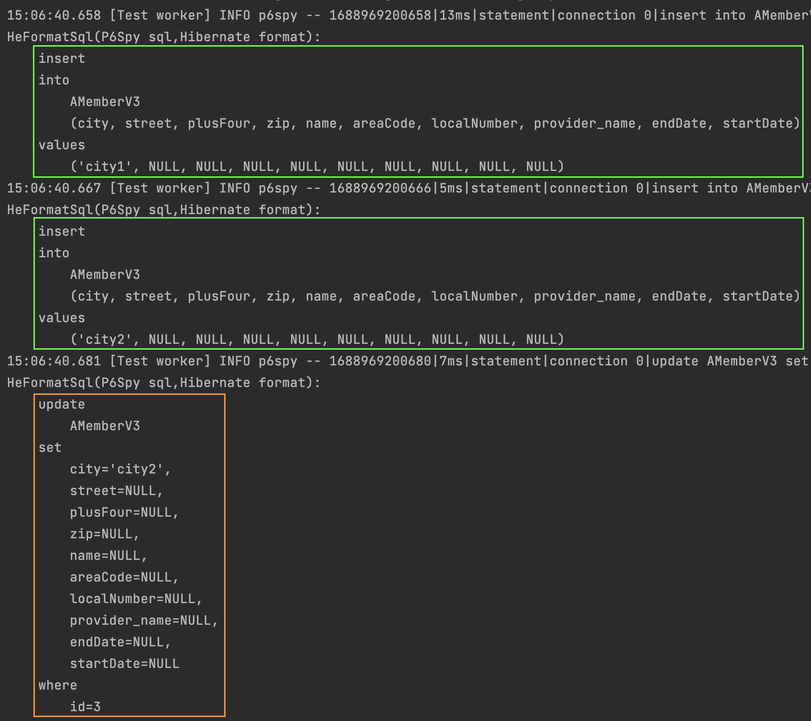

#### 임베디드 타입
`임베디드` 타입에 대해서 알아보자.  
먼저, `멤버` 엔티티를 생성해보자.  
`멤버` 엔티티의 속성은 `이름, 근무시작일, 근무종료일, 주소 도시, 주소 번지, 주소 우편번호` 등이 있다.

~~~java
@Entity
public class AMemberV1 {
    @Id
    @GeneratedValue(strategy = GenerationType.IDENTITY)
    private int id;
    private String name;

    // 근무기간
    private LocalDateTime startDate;
    private LocalDateTime endDate;

    // 집 주소
    private String city;
    private String street;
    private String zipcode;
}
~~~

위의 엔티티는 어떠한가?  
엔티티를 개선하기 전에 조금 더 객체지향적으로 `멤버` 엔티티를 정의해보겠다.  
`멤버 엔티티는 이름, 근무기간, 집 주소를 가진다.`  
어떠한가? 조금 더 명확하고 직관적인 것 같다. 코드로 표현해보자.  
클래스는 늘어났지만 중요 엔티티인 `멤버` 엔티티 입장에서는 훨씬 가독성이 좋아졌다고 볼 수 있다.  

실제로는 `@Embedded, @Embeddable` 중 한 곳에만 어노테이션을 추가하면 되므로,   
`멤버` 엔티티에서 `@Embedded`를 제거한다면 가독성이 더 좋아진다고 볼 수 있다.

`v1 -> v2`간에 클래스는 늘어나고 가독성은 좋아졌지만, 실제 데이터베이스 테이블의 구조는 똑같다.  
잘 설계한 객체지향 구조는 실제 테이블의 수보다 클래스의 수가 많은것이 맞다고 한다.

~~~java
@Entity
public class AMemberV2 {
    @Id
    @GeneratedValue(strategy = GenerationType.IDENTITY)
    private int id;
    private String name;

    @Embedded
    private Period workPeriod;

    @Embedded
    private Address homeAddress;
}

@Embeddable
public class Period {
    private LocalDateTime startDate;
    private LocalDateTime endDate;
}

@Embeddable
public class Address {
    private String city;
    private String street;
    private String zipcode;
}
~~~

조금 더 복잡한 구조를 예시로 만들어보자.  

~~~java
@Entity
public class AMemberV3 {
    @Id
    @GeneratedValue(strategy = GenerationType.IDENTITY)
    private int id;
    private String name;
    private Period workPeriod;
    private Address homeAddress;
    private PhoneNumber phoneNumber;
}

@Embeddable
public class Period {
    private LocalDateTime startDate;
    private LocalDateTime endDate;
}

@Embeddable
public class Address {
    private String city;
    private String street;
    private ZipCode zipCode;
}

@Embeddable
public class ZipCode {
    private String zip;
    private String plusFour;
}

@Embeddable
public class PhoneNumber {
    private String areaCode;
    private String localNumber;
    @ManyToOne
    private PhoneServiceProvider provider;
}

@Entity
public class PhoneServiceProvider {
    @Id
    private String name;
}
~~~

위의 예시는 몇개의 테이블이 생성되고 각 테이블에는 어떤 컬럼이 있는지 생각해보자.  
정답은 아래와 같다.

#### 임베디드 사용시 주의할 점  
아래 테스트코드는 치명적인 문제점을 일으킨다.  
해당 문제는 jpa의 문제라기보다는 자바언어의 값참조 방식에 따른 이슈라고 볼 수 있다.  

아래의 테스트코드에서 `address2`와 `address1`은 같은 메모리주소를 공유한다.  
따라서, `address2`의 데이터를 변경하게 된다면 `address1`도 값이 변경되게 되는 것이다.

문제는 jpa에서 엔티티의 변화가 감지되어 `update`문까지 실행되기 때문에 치명적인 문제를 발생시키는 것이다.

~~~java
@Test
void embedded1() {
    template(manager -> {
        AMemberV3 member1 = new AMemberV3();
        Address address1 = new Address();
        address1.setCity("city1");
        member1.setHomeAddress(address1);
        manager.persist(member1);

        AMemberV3 member2 = new AMemberV3();
        Address address2 = member1.getHomeAddress();
        address2.setCity("city2");
        member2.setHomeAddress(address2);
        manager.persist(member2);
    });
}
~~~

#### 해결방안
어떻게 해결할까?  

위의 문제를 일으키는 코드는 막을 방법이 없다.  
할 수 있는 해결책이라고는 개발자가 이런 사항을 잘 알고 개발하거나,  
아니면 값 참조를 아예 못하도록 불변객체로 만드는 정도이다.  

`불변객체`로라도 만들어보자.   

아래와 같이 `setter`는 전부 제거하였다.  
새로운 값을 할당하려면 생성자를 통해 새로운 인스턴스를 만들어야 할 것이다.

~~~java
@Getter
//@Setter
@Embeddable
public class Address {
    private String city;
    private String street;
    private ZipCode zipCode;

    protected Address() {} // jpa에서 기본생성자는 필수이다.

    public Address(String city, String street, ZipCode zipCode) {
        this.city = city;
        this.street = street;
        this.zipCode = zipCode;
    }
}
~~~

`setter`가 없으므로 아래와 같이 값을 복사해서 사용할 수 밖에 없도록 강제하였다.  
불편하지 않을 수 없다.

~~~java
@Test
void embedded2() {
    template(manager -> {
        AMemberV4 member1 = new AMemberV4();
       Address address1 = new Address("city1", "street1", null);
        member1.setHomeAddress(address1);
        manager.persist(member1);

        AMemberV4 member2 = new AMemberV4();
        Address address2 =
                new Address(member1.getHomeAddress().getCity(), member1.getHomeAddress().getStreet(), member1.getHomeAddress().getZipCode());
        member2.setHomeAddress(address2);
        manager.persist(member2);
    });
}
~~~