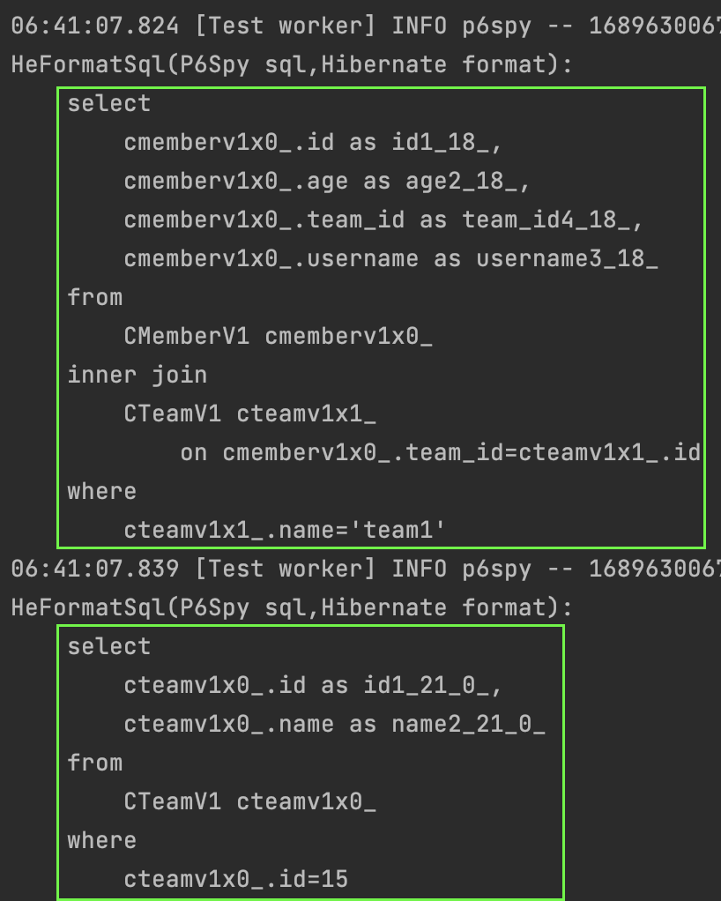
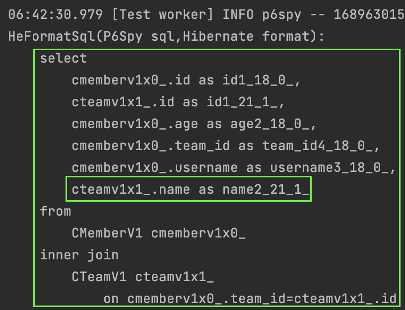

#### jpql 조인
jpql에서의 조인을 알아보자.  
[jpql](1_jpql.md)에서 jpql은 일반 sql과 상당히 비슷하지만 다른점이 분명히 있다고 했다.  
바로 조인 부분이 그 중 하나이다.  
어떤 점이 다른지 하나씩 알아보자.

##### 내부조인
아래의 쿼리에서 일반 sql문법과 차이점을 찾아보자.  
회원과 팀 테이블을 조인한다면 일반 sql에서는 `from member m inner join team t on m.team_id = t.team_id`와 같이 조인했을 것이다.  
그러나, 아래의 예시에서는 `from member m inner join m.team` 이 끝이다.  

특이하지만 사실은 이렇게 할 수 밖에 없기도 하다.  
sql에서 `from member m inner join team t on m.team_id = t.team_id`에서 `m.team_id`부분은 애초에 할수없기 때문이다.  

~~~java
@Test
void innerJoin(){
    template(manager->{
        List<CMemberV1> members=manager.createQuery(
            "select m from CMemberV1 m inner join m.team t where t.name = :name",
            CMemberV1.class)
        .setParameter("name","team1")
        .getResultList();
    });
}
~~~

##### 외부조인
외부조인도 위의 jpql 내부조인과 문법이 같다.

~~~java
@Test
void outerJoin(){
    template(manager->{
        CTeamV1 team1=new CTeamV1();
        team1.setName("team1");
        manager.persist(team1);
    
        CMemberV1 member1=new CMemberV1();
        member1.setUsername("name1");
        member1.setAge(10);
        member1.setTeam(team1);
        manager.persist(member1);
    
        CMemberV1 member2=new CMemberV1();
        member2.setUsername("name2");
        member2.setAge(20);
    //  member2.setTeam(team1); // for outer join test
        manager.persist(member2);
    });

    template(manager->{
        List<CMemberV1> members=manager.createQuery(
        "select m from CMemberV1 m left join m.team t order by m.age asc",
        CMemberV1.class)
        .getResultList();
    
        assertEquals(2,members.size());
        assertNotNull(members.get(0).getTeam());
        assertNull(members.get(1).getTeam());
    });
}
~~~

##### 컬렉션조인
일대다 혹은 다대다 관계에서는 조인의 결과값이 컬렉션이 된다.  
이러한 조인을 컬렉션 조인이라 한다.  
팀 관점에서 팀과 회원의 관계를 예시로 들 수 있다.  
예제만 보고 넘어가자.

~~~java
@Test
void collectionJoin() {
    template(manager -> {
        CTeamV1 team1 = new CTeamV1();
        team1.setName("team1");
        manager.persist(team1);

        CMemberV1 member1 = new CMemberV1();
        member1.setUsername("name1");
        member1.setAge(10);
        member1.setTeam(team1);
        manager.persist(member1);

        CMemberV1 member2 = new CMemberV1();
        member2.setUsername("name2");
        member2.setAge(20);
        member2.setTeam(team1);
        manager.persist(member2);
    });

    template(manager -> {
        List<CMemberV1> members = manager.createQuery(
                        "select m from CTeamV1 t left join t.members m",
                        CMemberV1.class)
                .getResultList();

        assertEquals(2, members.size());
    });
}
~~~

#### 세타조인
FK로 연결되어있지 않은 테이블들을 조인할때에는 세타조인을 사용할 수 있다. 

~~~java
@Test
void thetaJoin() {
    template(manager -> {
        CTeamV1 team1 = new CTeamV1();
        team1.setName("name1");
        manager.persist(team1);

        CMemberV1 member1 = new CMemberV1();
        member1.setUsername("name1");
        member1.setAge(10);
        member1.setTeam(team1);
        manager.persist(member1);

        CMemberV1 member2 = new CMemberV1();
        member2.setUsername("name2");
        member2.setAge(20);
        member2.setTeam(team1);
        manager.persist(member2);
    });

    template(manager -> {
        CMemberV1 member = manager.createQuery(
                        "select m from CMemberV1 m, CTeamV1 t where m.username = t.name",
                        CMemberV1.class)
                .getSingleResult();

        assertEquals("name1", member.getUsername());
    });
}
~~~

#### 페치조인
`페치조인`은 일반적인 조인의 종류는 아니며 jpql에서 성능최적화를 위해 제공하는 쿼리이다.  
이것은 우리가 배운 `지연로딩, 즉시로딩`과도 관련이 있다.
이는 위의 `내부조인`예시와 비교해서 보면 이해가 편할 수 있다.  

~~~
select m from CMemberV1 m inner join m.team // 내부조인
select m from CMemberV1 m join fetch m.team // 페치조인
~~~

위의 jpql을 수행하고 아래의 로직을 수행한다고 가정해보자.  

~~~
member.getTeam().getName()
~~~

`내부조인`은 두번의 조인이 일어난다.  
jpql의 결과값에 `m`값만을 조회했기 때문에 `팀` 엔티티는 비어있기 때문이다.  
따라서, `팀`의 데이터를 조회하면 `지연로딩`으로 아래와 같이 한번더 sql이 실행된다.

`페치조인`은 아래와 같이 `m`값만 조회하더라도 실제 수행되는 sql은 팀의 데이터도 같이 조회한다.  
따라서, `팀`의 데이터를 조회하더라도 이미 `즉시로딩`을 한것과 같기 때문에 별도의 sql이 수행되지 않는다.

#### 컬렉션 페치조인
`일대다` 관계에서 컬렉션을 `페체조인`해보자.  
먼저 실제 데이터베이스에 팀 데이터 1개 그리고 해당 팀에 소속된 회원데이터 2개가 들어있다고 가정해보자.  
팀과 회원을 조인하면 2개의 row가 조회될 것이다.

~~~java
@Test
void collectionFetchJoin() {
    template(manager -> {
        CTeamV1 team1 = new CTeamV1();
        team1.setName("team1");
        manager.persist(team1);

        CMemberV1 member1 = new CMemberV1();
        member1.setUsername("name1");
        member1.setAge(10);
        member1.setTeam(team1);
        manager.persist(member1);

        CMemberV1 member2 = new CMemberV1();
        member2.setUsername("name2");
        member2.setAge(20);
        member2.setTeam(team1);
        manager.persist(member2);
    });

    template(manager -> {
        List<CTeamV1> teams = manager.createQuery(
                        "select t from CTeamV1 t join fetch t.members",
                        CTeamV1.class)
                .getResultList();

        teams.forEach(team -> {
            log.info("team name: {}", team.getName());
            log.info("team members size: {}", team.getMembers().size());
        });

        assertEquals(teams.get(0), teams.get(1));
        assertEquals(teams.get(0).members, teams.get(1).members);
    });
}
~~~

다시 jpa의 관점에서 생각해보자.  
위의 코드에서 `List<CTeamV1> teams`은 두개의 데이터가 들어있게 된다.  
그리고 결과적으로 두개의 데이터는 완전히 동일하다.  

실제로 위의 테스트코드는 통과한다.

