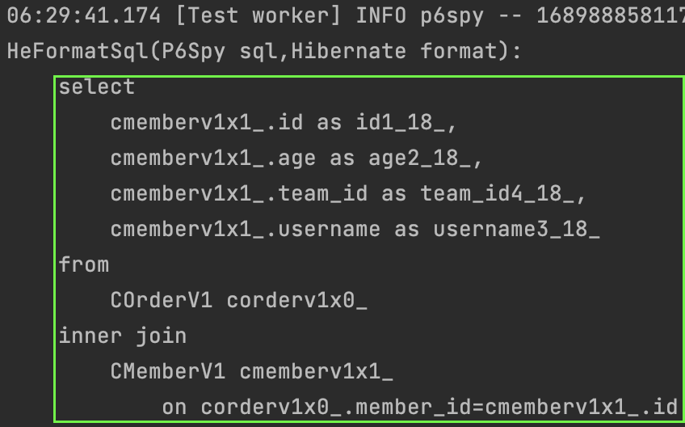
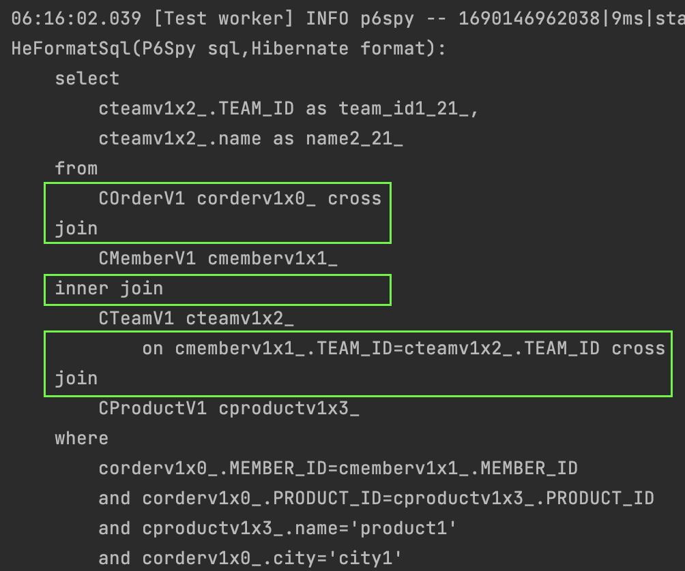
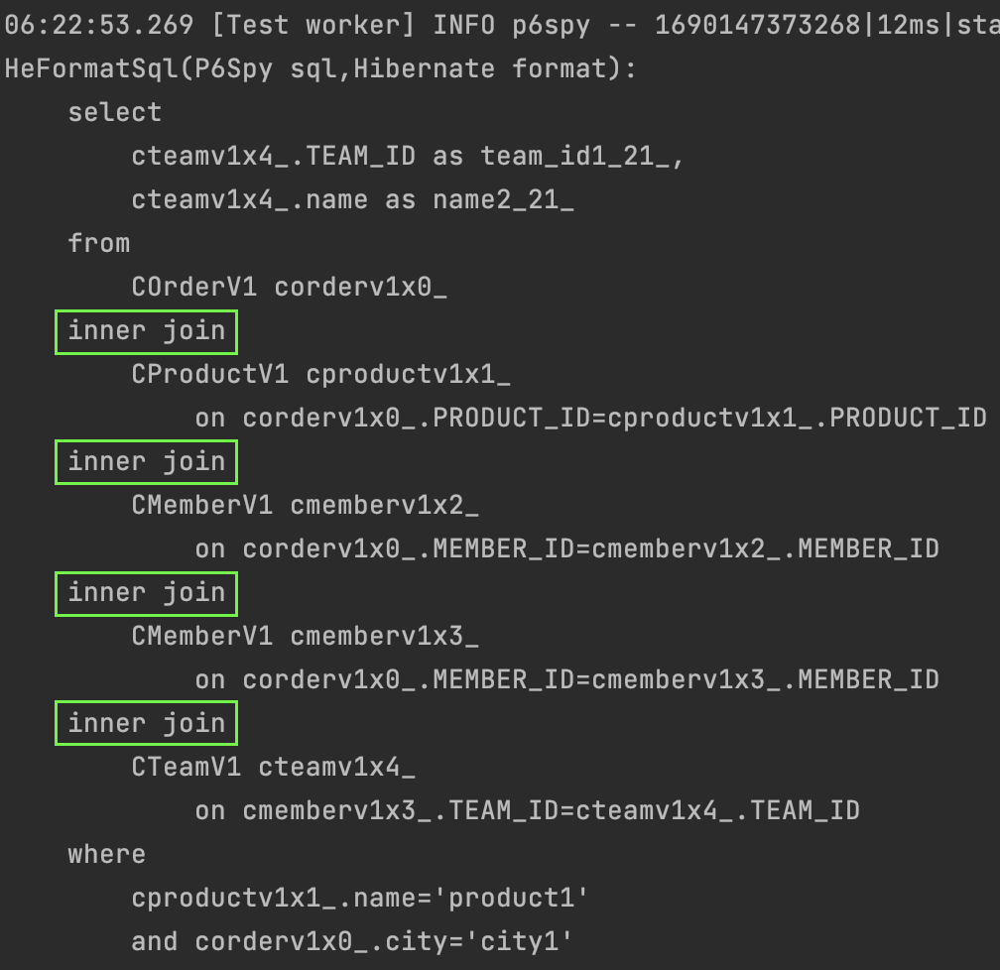
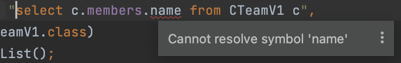

#### 경로표현식
경로표현식을 알아보자.  
경로는 jpql내에서 `.`을 찍어가면서 객체그래프를 탐색하는것이다.  

마치 엔티티 내에서 예를 들어 `회원`엔티티에서 `팀`엔티티를 탐색하고,  
`팀`에서 또다른 엔티티를 탐색해나가는것을 jpql 내에서 해보는것이다.

~~~sql
select m.username
  from Member m
       join m.team t
       join m.orders o
 where t.name = 'name1'
;
~~~

먼저 용어부터 정리하고 진행하자.  
~~~
[필드 용어]
- 상태필드(state field): 단순값을 저장하기 위한 필드이다. 예를 들어 회원의 이름(m.name), 회원의 키(m.height)등이 해당한다.
- 연관필드(association field): 엔티티로 치면 연관엔티티를 의미한다. 위의 예시에서 `from Member`를 시작으로 m.team을 탐색한다면 이는 연관필드에 해당한다.  
  연관필드와의 관계가 일대일 혹은 다대일이라면 단일 값 연관필드라고 한다.
  연관필드와의 관계가 다대다 혹은 일대다이라면 컬렉션 값 연관필드라고 한다.  
  
[조인 용어]
- 명시적 조인: join 조건을 직접 설정하는 것이다.  
- 묵시적 조인: jpql의 경로표현식에 의해 join 조건을 jpa 구현체에게 위임하는 것이다.
~~~

엔티티 코드로 보면 아래와 같을 것이다.

~~~java
@Entity
public class CMemberV1 {
    @Id
    @GeneratedValue(strategy = GenerationType.IDENTITY)
    private int id;
    private String username;            // 상태필드
    private int age;                    // 상태필드

    @ManyToOne
    private CTeamV1 team;               // 단일 값 연관필드

    @OneToMany(mappedBy = "member")
    private List<COrderV1> orders;      // 컬렉션 값 연관필드
}
~~~

경로표현식의 특징도 보고가자.

~~~
- 상태필드: 경로탐색의 끝이다. 당연하다. 상태필드는 필드값일 뿐 더이상 경로탐색을 진행할 수 있는 엔티티가 아니기 때문이다.
- 단일 값 연관필드: 묵시적으로 내부조인이 일어난다. 엔티티에서 계속해서 경로탐색을 진행하는것처럼 jpql에서도 계속해서 탐색을 진행할 수 있다.
- 컬렉션 값 연관필드: 묵시적으로 내부조인이 일어난다. 특이한 점은 엔티티임에도 불구하고 경로탐색을 더이상 진행할 수 없다는 점이다. 
~~~

#### 단일 값 연관경로 탐색
아래의 jpql의 예시는 단일값 연관경로 탐색의 예시이다.  
`order`와 `member`의 관계는 `다대일`이기 때문이다.  

~~~sql
select o.member from COrderV1 o
~~~

생성되는 실제 쿼리문은 아래와 같다.  
`inner join`이 걸린 sql이 생성되었다.    
위에서 `묵시적 내부조인`이 일어난다는 부분이 이부분이다.    
결과적으로 `회원`을 검색했지만 `주문`이 없는 `회원`은 조회가 안될 것이다.

#### 묵시적 조인의 주의할 점
아래의 예시에서 쿼리문은 꽤나 복잡하다.  
총 4개의 테이블을 조인하게 되기 때문이다.    
그리고 별도로 join 조건을 걸지 않았기 때문에 `묵시적 조인`이 일어날 것을 추측해볼 수 있다.

~~~java
@Test
void pathExpression2() {
    template(manager -> {
        // team
        CTeamV1 team1 = new CTeamV1();
        team1.setName("team1");
        manager.persist(team1);

        // member
        CMemberV1 member1 = new CMemberV1();
        member1.setTeam(team1);
        member1.setUsername("name1");
        member1.setAge(10);
        manager.persist(member1);

        CMemberV1 member2 = new CMemberV1();
        member2.setUsername("name2");
        member2.setAge(20);
        manager.persist(member2);

        // product
        CProductV1 product1 = new CProductV1();
        product1.setName("product1");
        manager.persist(product1);

        // order
        COrderV1 order1 = new COrderV1();
        order1.setMember(member1);
        order1.setOrderAmount(100);
        order1.setProduct(product1);
        order1.setAddress(new CAddressV1("city1", "street1", "00000"));
        manager.persist(order1);

        COrderV1 order2 = new COrderV1();
        order2.setMember(member1);
        order1.setProduct(product1);
        order2.setOrderAmount(200);
        manager.persist(order2);
    });

    template(manager -> {
        List<CTeamV1> teams = manager.createQuery(
                        "select o.member.team from COrderV1 o where o.product.name='product1' and o.address.city='city1'",
                        CTeamV1.class)
                .getResultList();
        log.info("team size: {}", teams.size());
    });
}
~~~

결과로 생성되는 쿼리는 아래와 같다.
`주문과 회원`, 그리고 `주문과 상품`에서 `cross join`이 발생하였다.  
`where` 조건에서 각 테이블의 키값을 올바르게 연결해주기 때문에 의도한대로 결과값은 나오겠지만,  
이는 사용자가 의도한 sql문은 아니다.

하이버네이트에서 `묵시적조인`은 `cross join`을 사용하는 경향이 있다.  
이는 성능상 좋지않을뿐더러 사용자가 의도한대로 (대부분 `inner join`) 쿼리가 생성되지 않는문제가 있다.  
위의 `묵시적조인`을 발생시키는 jpql문을 명시적조인으로 변경해보자.

~~~java
@Test
void pathExpression3() {
    template(manager -> {
        // team
        CTeamV1 team1 = new CTeamV1();
        team1.setName("team1");
        manager.persist(team1);

        // member
        CMemberV1 member1 = new CMemberV1();
        member1.setTeam(team1);
        member1.setUsername("name1");
        member1.setAge(10);
        manager.persist(member1);

        CMemberV1 member2 = new CMemberV1();
        member2.setUsername("name2");
        member2.setAge(20);
        manager.persist(member2);

        // product
        CProductV1 product1 = new CProductV1();
        product1.setName("product1");
        manager.persist(product1);

        // order
        COrderV1 order1 = new COrderV1();
        order1.setMember(member1);
        order1.setOrderAmount(100);
        order1.setProduct(product1);
        order1.setAddress(new CAddressV1("city1", "street1", "00000"));
        manager.persist(order1);

        COrderV1 order2 = new COrderV1();
        order2.setMember(member1);
        order1.setProduct(product1);
        order2.setOrderAmount(200);
        manager.persist(order2);
    });

    template(manager -> {
        List<CTeamV1> teams = manager.createQuery(
                        "select o.member.team from COrderV1 o inner join o.product inner join o.member inner join o.member.team where o.product.name='product1' and o.address.city='city1'",
                        CTeamV1.class)
                .getResultList();
        log.info("team size: {}", teams.size());
    });
}
~~~

#### 컬렉션 값 연관경로 탐색
경로표현식의 특징에서 컬렉션 값 연관필드는 경로탐색을 더이상 할 수 없다는 것이다.
아래의 jpql코드에서 컬렉션 값 연관필드인 `members`의 `name`을 조회하려고 하면 감사하게도 컴파일오류가 발생한다.

컬렉션값 연관필드로부터 경로탐색을 더 하고싶다면 아래와 같이 명시적조인으로 별칭을 부여하고 진행해야 한다.

~~~sql
select m.username from CTeamV1 c inner join c.members m
~~~
