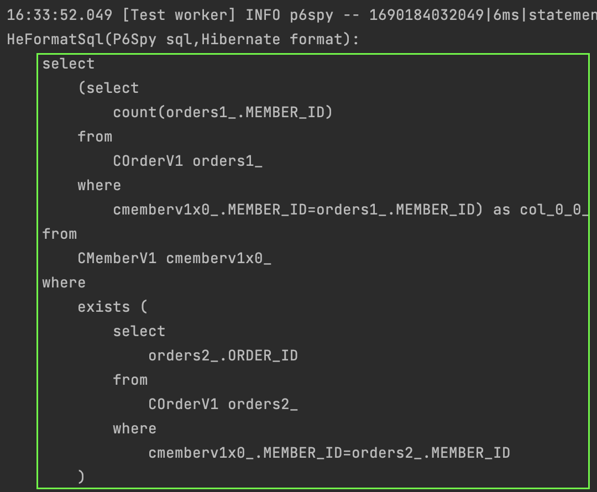
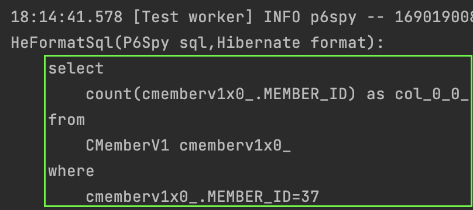

#### 서브쿼리
jpql의 서브쿼리 사용법을 알아보자.  
먼저 서브쿼리를 적용한 jpql 몇개를 살펴보자.

여태 jpql 학습을 잘 했고 sql기본지식이 있다면 어렵지않게 이해할 수 있을 것이다.
~~~sql
-- 평균나이보다 많은 회원 조회
select m from CMemberV1 m where m.age > (select avg(m2.age) from CMemberV1 m2)
-- 주문을 1건 이상 한 회원 조회 
select m from CMemberV1 m where (select count(o) from COrderV1 o where m = o.member) > 0
-- team1 소속 회원 조회
select m from CMemberV1 m where exists (select t from m.team t where t.name = 'team1')
-- 상품의 재고수보다 주문량이 많은 주문 조회
select o from COrderV1 o where o.orderAmount > ALL(select p.stockAmount from CProductV1 p)
-- 20세 이상 회원이 있는 팀 조회
select t from CTeamV1 t where t IN (select t2 from CTeamV1 t2 inner join t2.members m2 where m2.age >= 20)
~~~

#### 컬렉션 식
컬렉션 식은 말 그대로 컬렉션에서 사용할 수 있는 특별한 함수이다.  
예를 들어 아래의 jpql에서 `is not empty`와 같은 기능은 실제 sql이 아닌 jpql에서만 사용할 수 있는 컬렉션 식이다.  
또한 `select` 부분의 `size` `함수도` 컬렉션에만 붙일 수 있는 컬렉션 식이다.

~~~sql
select m.orders.size from CMemberV1 m where m.orders is not empty
~~~

생성되는 쿼리는 아래와 같다.

#### 다형성 쿼리
[상속](../../ch5/description/1_inheritance.md)에서 배웠던 것들을 jpql로 조회해보자.  
상송 중 싱글테이블 전략을 사용할 떄에 jpql의 사용은 아래와 같이 할 수 있다.

~~~sql
select i from MyItemV2 i where type(i) in (MyAlbumV2)
~~~

#### 엔티티 직접사용
아래의 jpql은 실제 sql의 문법과 다른 부분이 많다.  
`count(m)` 부분과 `m = :member` 부분이다.  
sql문에서 엔티티를 다루는것이 특징이다.  
아래의 jpql문은 sql로 어떻게 변환되는지 살펴보자.

~~~sql
select count(m) from CMemberV1 m where m = :member
~~~

생성되는 쿼리는 아래와 같다.  
`count(m)`은 `count(member.MEMBER_ID)`로 변경되었고,
`m = :member` 부분은 `member.MEMBER_ID = 37`로 전부 해당 테이블의 키값컬럼으로 변경된 것을 알 수 있다.

