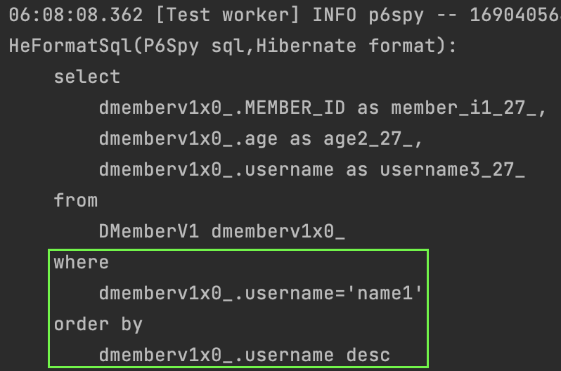
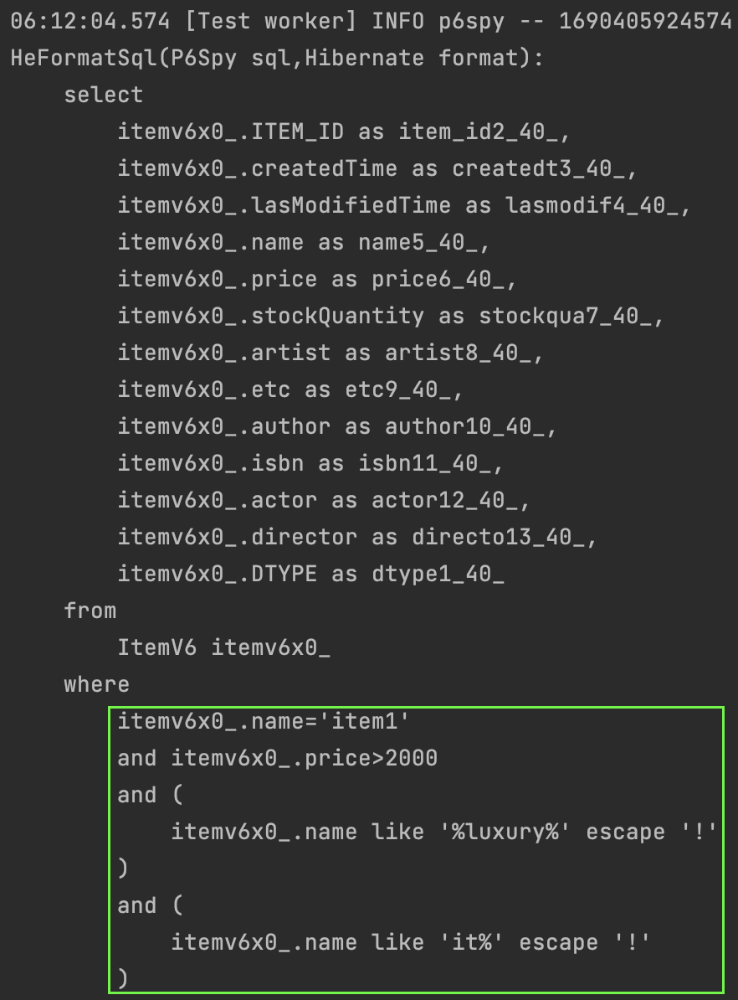
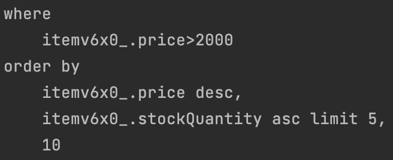
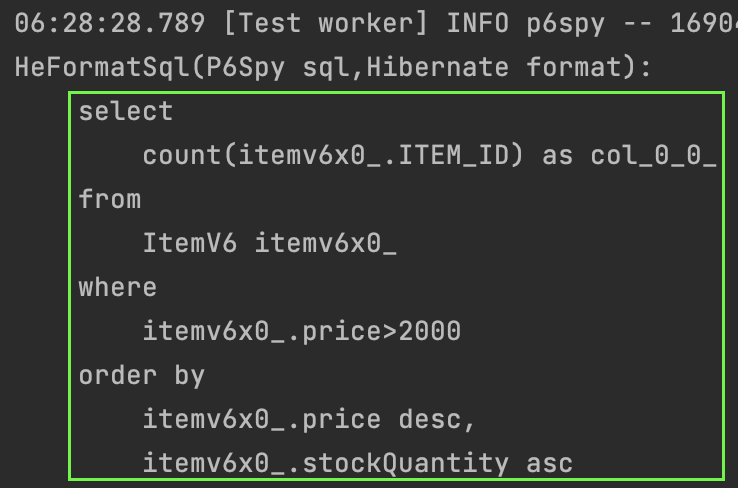
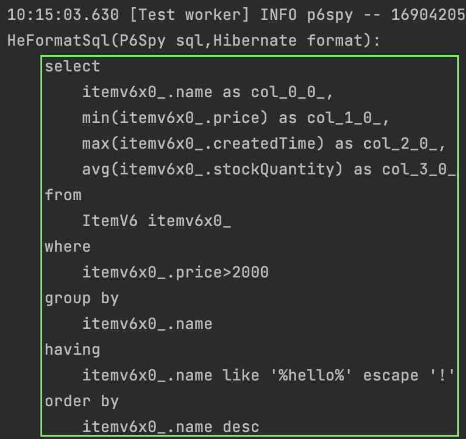

#### querydsl
querydsl은 jpa 엔티티 조회를 손쉽게 해주는 도구이다.  
문자열기반의 jpql을 조금 더 가독성있고 컴파일오류를 줄이면서 사용할 수 있다.  
기능을 하나씩 사용해보며 익숙해지면 된다.  

~~~java
query.from(member1)
    .where(member1.username.eq("name1"))
    .orderBy(member1.username.desc())
    .stream().toList();
~~~

~~~java
query.from(item1)
    .where(item1.name.eq("item1")           
        .and(item1.price.gt(2000))          
        .and(item1.name.contains("luxury")) 
        .and(item1.name.startsWith("it")))  
    .stream().toList();
~~~

#### 페이징
querydsl에서는 기존에 전체 `count()`를 할 수 있는 기능을 제공했으나, deprecate 되었다.  
`groupby` 등이 포함된 복잡한 쿼리에서 많은 오류가 발생했고, 이를 모든 dbms에 적용되도록 만드는것이 쉽지않기 때문이라고 한다.  
아래와 같이 `count()`를 따로 수행하는 수 밖에 없다.

~~~java
query.from(item1)
    .where(item1.price.gt(2000))
    .orderBy(item1.price.desc(), item1.stockQuantity.asc())
    .offset(5).limit(10)
    .stream().toList();
~~~

~~~java
query.from(item1)
    .select(item1.count())
    .where(item1.price.gt(2000))
    .orderBy(item1.price.desc(), item1.stockQuantity.asc())
    .fetchOne()
~~~

~~~java
query
    .select(item1.name, item1.price.min(), item1.createdTime.max(), item1.stockQuantity.avg())
    .from(item1)
    .where(item1.price.gt(2000))
    .groupBy(item1.name)
    .having(item1.name.contains("hello"))
    .orderBy(item1.name.desc())
    .fetch();
~~~

