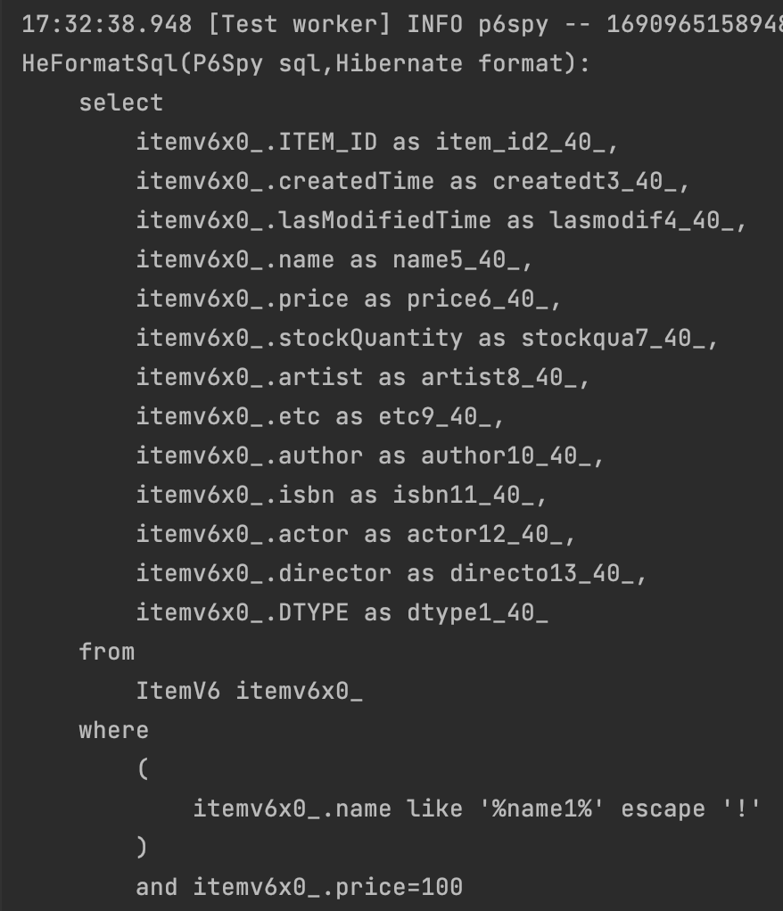

#### 프로젝션
querydsl의 결과값이 여러 필드이면 기본적으로 `Tuple`이라는 `Map`과 비슷한 자료구조로 리턴이 된다.  
그것보다는 개발자가 지정한 DTO 등에 반환하는것이 관리에 좋을 것이다.  
실습해보자.

#### 프로젝션 대상 1개
프로젝션 대상이 하나이면 아래와 같이 String 리스트로 받을 수 있다.
~~~java
List<String> names =
        query.select(item1.name)
        .from(item1)
        .stream().toList();
~~~

#### 여러 컬럼반환
컬럼이 여러개이면 기본적으로 `Tuple` 자료구조에 담겨서 리턴된다.  
그리고 `Tuple`은  `tuple.get(item1.name)`와 같이 포함하는 내용을 조회해볼 수 있다.
~~~java
List<Tuple> tuples = query.select(item1.name, item1.price)
        .from(item1)
        .stream().toList();
for(Tuple tuple : tuples) {
    log.info("name: {}", tuple.get(item1.name));
    log.info("price: {}", tuple.get(item1.price));
}
~~~

#### 빈으로 반환
바로 위의 예시를 담을 DTO부터 만들자.

~~~java
@Getter
@Setter
@AllArgsConstructor
@NoArgsConstructor
public class ItemDTOV1 {
    private String name;
    private int price;
}
~~~

그리고 빈으로 반환해보자.  
`bean() `메서드는 `setter`를 통해서 매핑을 한다. 따라서 이름이 정확하게 맞아야 한다.
~~~java
List<ItemDTOV1> items =
        query.select(
            Projections.bean(
                ItemDTOV1.class,
                item1.name.as("itemName"), // item은 name 이고 DTO는 itemName이므로 alias를 지정하여 맞춰주어야 한다.
                item1.price))
        .from(item1)
        .stream().toList();
~~~

생성자를 이용하여 매핑하는 방법도 있다.  
`constructor()` 이다. 생성자를 통한 매핑은 타입과 순서가 정확하게 매핑되어야 한다.
~~~java
List<ItemDTOV1> items =
        query.select(
            Projections.constructor(
                ItemDTOV1.class,
                item1.name,
                item1.price))
        .from(item1)
        .stream().toList();
~~~

#### 동적쿼리
어플리케이션에서 보내오는 파라미터에 따라 동적쿼리를 만들어야 할 경우에도 querydsl을 사용할 수 있다.  

~~~java
@Test
void dynamic1() {
    // application parameters
    Map<String, Object> parameters = new HashMap<>();
    parameters.put("price", 100);
    parameters.put("name", "name1");

    // set parameters
    QItemV6 item1 = QItemV6.itemV6;
    BooleanBuilder builder = new BooleanBuilder();
    if (parameters.containsKey("name")) {
        builder.and(item1.name.contains((String)parameters.get("name")));
    }
    if (parameters.containsKey("price")) {
        builder.and(item1.price.eq((Integer)parameters.get("price")));
    }

    // query
    template(manager -> {
        JPAQueryFactory query = new JPAQueryFactory(manager);
        List<ItemV6> items =
                query.selectFrom(item1)
                .where(builder)
                .stream().toList();
    });
}
~~~
아래와 같은 쿼리가 만들어진다.

